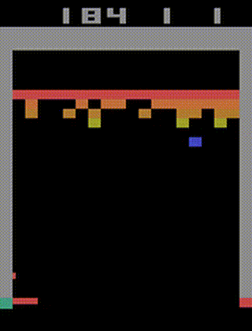

<p align="center">

</p>

> PARL 是一个高性能、灵活的强化学习框架。
# 特点
**可复现性保证**。我们提供了高质量的主流强化学习算法实现，严格地复现了论文对应的指标。

**大规模并行支持**。框架最高可支持上万个CPU的同时并发计算，并且支持多GPU强化学习模型的训练。

**可复用性强**。用户无需自己重新实现算法，通过复用框架提供的算法可以轻松地把经典强化学习算法应用到具体的场景中。

**良好扩展性**。当用户想调研新的算法时，可以通过继承我们提供的基类可以快速实现自己的强化学习算法。


# 框架结构
  
PARL的目标是构建一个可以完整复杂任务的智能体。以下是用户在逐步构建一个智能体的过程中需要了解到的结构：

### Model
`Model` 用来定义前向(`Forward`)网络，这通常是一个策略网络(`Policy Network`)或者一个值网络(`Value Function`)，输入是当前环境状态(`State`)。

### Algorithm
`Algorithm` 定义了具体的算法来更新前向网络(`Model`)，也就是通过定义损失函数来更新`Model`。一个`Algorithm`包含至少一个`Model`。

### Agent
`Agent` 负责与环境进行交互，生成数据提供给`Algorithm`来更新模型(`Model`)，数据的预处理流程也一般定义在这里。

以下是构建一个包含DQN算法的智能体(`Agent`)用来玩雅达利游戏(`Atari Games`)的示例：

```python
import parl
from parl.algorithms import DQN

class AtariModel(parl.Model):
	"""AtariModel
	This class defines the forward part for an algorithm,
	its input is state observed on environment.
	"""
	def __init__(self, img_shape, action_dim):
		# define your layers
		self.cnn1 = layers.conv_2d(num_filters=32, filter_size=5,
			 			stride=1, padding=2, act='relu')
		...
		self.fc1 = layers.fc(size=1)
		
	def value(self, img):
		# define how to estimate the Q value based on the image of atari games.
		img = img / 255.0
		l = self.cnn1(img)
		...
		Q = self.fc1(l)
		return Q
"""
三个步骤定义一个智能体
   1.  定义前向模型，就是上面的值函数网络(Value)，定义了如何针对输入的图像中评估Q值。
   2.  通过DQN算法来更新模型，在这里我们直接import仓库中实现好的DQN算法即可。
   3.  在AtariAgent中定义I/O部分，通过交互得到的数据来更新模型。
"""

model = AtariModel(img_shape=(32, 32), action_dim=4)
algorithm = DQN(model)
agent = AtariAgent(algorithm)
```

# Parallelization
PARL provides a compact API for distributed training, allowing users to transfer the code into a parallelized version by simply adding a decorator.  
Here is a `Hello World!` example to demonstrate how easily it is to leverage outer computation resources.
```python
#============Agent.py=================
@parl.remote_class
class Agent(object):

	def say_hello(self):
		print("Hello World!")

	def sum(self, a, b):
		return a+b

# launch `Agent.py` at any computation platforms such as a CPU cluster.
if __main__ == '__main__':
    agent = Agent()
    agent.as_remote(server_address)


#============Server.py=================
remote_manager = parl.RemoteManager()
agent = remote_manager.get_remote()
agent.say_hello()
ans = agent.sum(1,5) # run remotely and not comsume any local computation resources 
```
Two steps to use outer computation resources:
1. use the `parl.remote_class` to decorate a class at first, after which it is transfered to be a new class that can run in other CPUs or machines.
2. Get remote objects from the `RemoteManager`, and these objects have the same functions as the real ones. However, calling any function of these objects **does not** consume local computation resources since they are executed elsewhere.


As shown in the above figure, real actors(orange circle) are running at the cpu cluster, while the learner(bule circle) is running at the local gpu with several remote actors(yellow circle with dotted edge).  

For users, they can write code in a simple way, just like writing multi-thread code, but with actors consuming remote resources. We have also provided examples of parallized algorithms like [IMPALA](examples/IMPALA), [A2C](examples/A2C) and [GA3C](examples/GA3C). For more details in usage please refer to these examples.  


# Install:
### Dependencies
- Python 2.7 or 3.5+. 
- PaddlePaddle >=1.2.1 (We try to make our repository always compatible with latest version PaddlePaddle)  


```
pip install parl
```

# Examples
- [QuickStart](examples/QuickStart/)
- [DQN](examples/DQN/)
- [DDPG](examples/DDPG/)
- [PPO](examples/PPO/)
- [IMPALA](examples/IMPALA/)
- [A2C](examples/A2C/)
- [GA3C](examples/GA3C/)
- [Winning Solution for NIPS2018: AI for Prosthetics Challenge](examples/NeurIPS2018-AI-for-Prosthetics-Challenge/)

   
<br>

