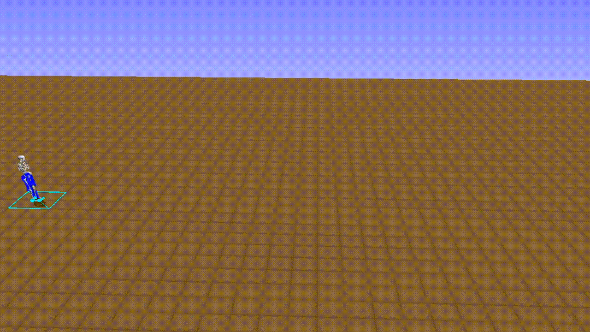

<p align="center">

</p>

English | [简体中文](./README.cn.md)

> PARL is a flexible and high-efficient reinforcement learning framework.

# Features
**Reproducible**. We provide algorithms that stably reproduce the result of many influential reinforcement learning algorithms.

**Large Scale**. Ability to support high-performance parallelization of training with thousands of CPUs and multi-GPUs.

**Reusable**.  Algorithms provided in the repository could be directly adapted to a new task by defining a forward network and training mechanism will be built automatically.

**Extensible**. Build new algorithms quickly by inheriting the abstract class in the framework.


# Abstractions

PARL aims to build an agent for training algorithms to perform complex tasks.   
The main abstractions introduced by PARL that are used to build an agent recursively are the following:

### Model
`Model` is abstracted to construct the forward network which defines a policy network or critic network given state as input.

### Algorithm
`Algorithm` describes the mechanism to update parameters in `Model` and often contains at least one model.

### Agent
`Agent`, a data bridge between the environment and the algorithm, is responsible for data I/O with the outside environment and describes data preprocessing before feeding data into the training process.

Here is an example of building an agent with DQN algorithm for Atari games.
```python
import parl
from parl.algorithms import DQN, DDQN

class AtariModel(parl.Model):
    """AtariModel
    This class defines the forward part for an algorithm,
    its input is state observed on the environment.
    """
    def __init__(self, img_shape, action_dim):
        # define your layers
        self.cnn1 = layers.conv_2d(num_filters=32, filter_size=5,
                         stride=1, padding=2, act='relu')
        ...
        self.fc1 = layers.fc(action_dim)
        
    def value(self, img):
        # define how to estimate the Q value based on the image of atari games.
        img = img / 255.0
        l = self.cnn1(img)
        ...
        Q = self.fc1(l)
        return Q
"""
three steps to build an agent
   1.  define a forward model which is critic_model in this example
   2.  a. to build a DQN algorithm, just pass the critic_model to `DQN`
       b. to build a DDQN algorithm, just replace DQN in the following line with DDQN
   3.  define the I/O part in AtariAgent so that it could update the algorithm based on the interactive data
"""

model = AtariModel(img_shape=(32, 32), action_dim=4)
algorithm = DQN(model)
agent = AtariAgent(algorithm)
```

# Parallelization
PARL provides a compact API for distributed training, allowing users to transfer the code into a parallelized version by simply adding a decorator.  
Here is a `Hello World` example to demonstrate how easy it is to leverage outer computation resources.
```python
#============Agent.py=================
@parl.remote_class
class Agent(object):

    def say_hello(self):
        print("Hello World!")

    def sum(self, a, b):
        return a+b

# launch `Agent.py` at any computation platforms such as a CPU cluster.
if __main__ == '__main__':
    agent = Agent()
    agent.as_remote(server_address)


#============Server.py=================
remote_manager = parl.RemoteManager()
agent = remote_manager.get_remote()
agent.say_hello()
ans = agent.sum(1,5) # run remotely and not consume any local computation resources
```
Two steps to use outer computation resources:
1. use the `parl.remote_class` to decorate a class at first, after which it is transferred to be a new class that can run in other CPUs or machines.
2. Get remote objects from the `RemoteManager`, and these objects have the same functions as the real ones. However, calling any function of these objects **does not** consume local computation resources since they are executed elsewhere.


As shown in the above figure, real actors(orange circle) are running at the cpu cluster, while the learner(blue circle) is running at the local gpu with several remote actors(yellow circle with dotted edge).  

For users, they can write code in a simple way, just like writing multi-thread code, but with actors consuming remote resources. We have also provided examples of parallized algorithms like [IMPALA](examples/IMPALA), [A2C](examples/A2C) and [GA3C](examples/GA3C). For more details in usage please refer to these examples.  


# Install:
### Dependencies
- Python 2.7 or 3.5+. 
- [PaddlePaddle](https://github.com/PaddlePaddle/Paddle) >=1.5.1 (**Optional**, if you only want to use APIs related to parallelization alone)  


```
pip install parl
```

# Examples
- [QuickStart](examples/QuickStart/)
- [DQN](examples/DQN/)
- [DDPG](examples/DDPG/)
- [PPO](examples/PPO/)
- [IMPALA](examples/IMPALA/)
- [A2C](examples/A2C/)
- [GA3C](examples/GA3C/)
- [Winning Solution for NIPS2018: AI for Prosthetics Challenge](examples/NeurIPS2018-AI-for-Prosthetics-Challenge/)

  
<br>

