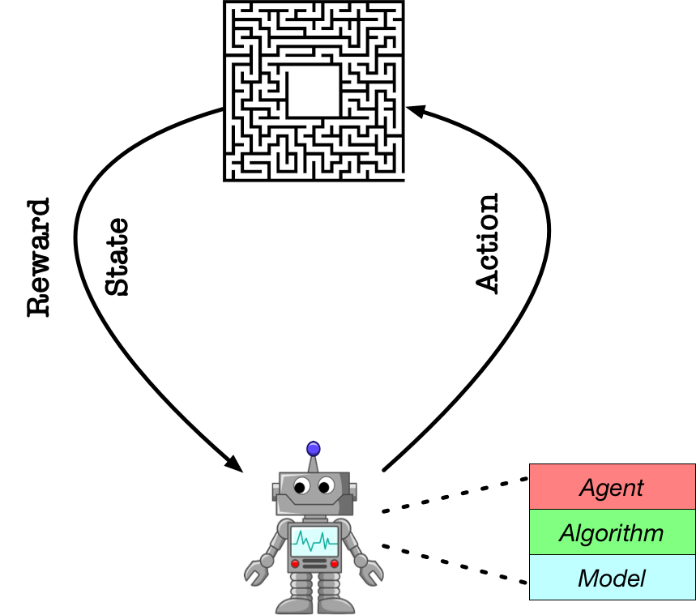

<p align="center">

</p>

> PARL is a flexible and high-efficient reinforcement learning framework based on [PaddlePaddle](https://github.com/PaddlePaddle/Paddle).

# Features
**Reproducible**. We provide algorithms that stably reproduce the result of many influential reinforcement learning algorithms

**Large Scale**. Ability to support high performance parallelization of training with thousands of CPUs and multi-GPUs 

**Reusable**.  Algorithms provided in repository could be directly adapted to a new task by defining a forward network and training mechanism will be built automatically.

**Extensible**. Build new algorithms quickly by inheriting the abstract class in the framework.


# Abstractions
  
PARL aims to build an agent for training algorithms to perform complex tasks.   
The main abstractions introduced by PARL that are used to build an agent recursively are the following:

### Model
`Model` is abstracted to construct the forward network which defines a policy network or critic network given state as input.

### Algorithm
`Algorithm` describes the mechanism to update parameters in `Model` and often contains at least one model.

### Agent
`Agent` is a data bridge between environment and algorithm. It is responsible for data I/O with outside and describes data preprocessing before feeding into the training process.

Here is an example of building an agent with DQN algorithm for atari games.
```python
import parl
from parl.algorithms import DQN, DDQN

class AtariModel(parl.Model):
	"""AtariModel
	This class defines the forward part for an algorithm,
	its input is state observed on environment.
	"""
	def __init__(self, img_shape, action_dim):
		# define your layers
		self.cnn1 = layers.conv_2d(num_filters=32, filter_size=5,
			 			stride=[1, 1], padding=[2, 2], act='relu')
		...
		self.fc1 = layers.fc(action_dim)
	def value(self, img):
		# define how to estimate the Q value based on the image of atari games.
		img = img / 255.0
		l = self.cnn1(img)
		...
		Q = self.fc1(l)
		return Q
"""
three steps to build an agent
   1.  define a forward model which is critic_model is this example
   2.  a. to build a DQN algorithm, just pass the critic_model to `DQN`
       b. to build a DDQN algorithm, just replace DQN in following line with DDQN
   3.  define the I/O part in AtariAgent so that it could update the algorithm based on the interactive data
"""

model = AtariModel(img_shape=(32, 32), action_dim=4)
algorithm = DQN(model)
agent = AtariAgent(algorithm)
```

# Install:
### Dependencies
- Python 2.7 or 3.5+. 
- PaddlePaddle >=1.2.1 (We try to make our repository always compatible with latest version PaddlePaddle)  


```
pip install --upgrade git+https://github.com/PaddlePaddle/PARL.git
```

# Examples
- [QuickStart](examples/QuickStart/)
- [DQN](examples/DQN/)
- [DDPG](examples/DDPG/)
- [PPO](examples/PPO/)
- [Winning Solution for NIPS2018: AI for Prosthetics Challenge](examples/NeurIPS2018-AI-for-Prosthetics-Challenge/)

   
<br>

