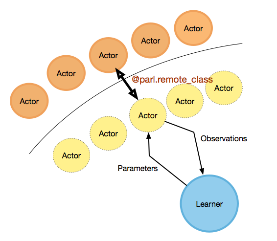

<p align="center">

</p>

English | [简体中文](./README.cn.md)   
[**Documentation**](https://parl.readthedocs.io)

> PARL is a flexible and high-efficient reinforcement learning framework.

# Features
**Reproducible**. We provide algorithms that stably reproduce the result of many influential reinforcement learning algorithms.

**Large Scale**. Ability to support high-performance parallelization of training with thousands of CPUs and multi-GPUs.

**Reusable**.  Algorithms provided in the repository could be directly adapted to a new task by defining a forward network and training mechanism will be built automatically.

**Extensible**. Build new algorithms quickly by inheriting the abstract class in the framework.


# Abstractions

PARL aims to build an agent for training algorithms to perform complex tasks.   
The main abstractions introduced by PARL that are used to build an agent recursively are the following:

### Model
`Model` is abstracted to construct the forward network which defines a policy network or critic network given state as input.

### Algorithm
`Algorithm` describes the mechanism to update parameters in `Model` and often contains at least one model.

### Agent
`Agent`, a data bridge between the environment and the algorithm, is responsible for data I/O with the outside environment and describes data preprocessing before feeding data into the training process.  

Note: For more information about base classes, please visit our [tutorial](https://parl.readthedocs.io/en/latest/getting_started.html) and [API documentation](https://parl.readthedocs.io/en/latest/model.html).

# Parallelization
PARL provides a compact API for distributed training, allowing users to transfer the code into a parallelized version by simply adding a decorator. For more information about our APIs for parallel training, please visit our [documentation](https://parl.readthedocs.io/en/latest/parallel_training/setup.html).  
Here is a `Hello World` example to demonstrate how easy it is to leverage outer computation resources.
```python
#============Agent.py=================
@parl.remote_class
class Agent(object):

    def say_hello(self):
        print("Hello World!")

    def sum(self, a, b):
        return a+b

parl.connect('localhost:8037')
agent = Agent()
agent.say_hello()
ans = agent.sum(1,5) # run remotely and not consume any local computation resources
```
Two steps to use outer computation resources:
1. use the `parl.remote_class` to decorate a class at first, after which it is transferred to be a new class that can run in other CPUs or machines.
2. call `parl.connect` to initialize parallel communication before creating an object. Calling any function of the objects **does not** consume local computation resources since they are executed elsewhere.


As shown in the above figure, real actors(orange circle) are running at the cpu cluster, while the learner(blue circle) is running at the local gpu with several remote actors(yellow circle with dotted edge).  

For users, they can write code in a simple way, just like writing multi-thread code, but with actors consuming remote resources. We have also provided examples of parallized algorithms like [IMPALA](examples/IMPALA), [A2C](examples/A2C) and [GA3C](examples/GA3C). For more details in usage please refer to these examples.  


# Install:
### Dependencies
- Python 2.7 or 3.5+. 
- [paddlepaddle>=1.6.1](https://github.com/PaddlePaddle/Paddle) (**Optional**, if you only want to use APIs related to parallelization alone)  


```
pip install parl
```

# Examples
- [QuickStart](examples/QuickStart/)
- [DQN](examples/DQN/)
- [ES](examples/ES/)
- [DDPG](examples/DDPG/)
- [PPO](examples/PPO/)
- [IMPALA](examples/IMPALA/)
- [A2C](examples/A2C/)
- [TD3](examples/TD3/)
- [SAC](examples/SAC/)
- [MADDPG](examples/MADDPG/)
- [Winning Solution for NIPS2018: AI for Prosthetics Challenge](examples/NeurIPS2018-AI-for-Prosthetics-Challenge/)
- [Winning Solution for NIPS2019: Learn to Move Challenge](examples/NeurIPS2019-Learn-to-Move-Challenge/)

  
<br>

