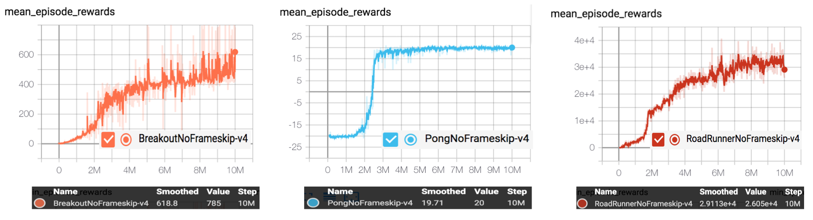
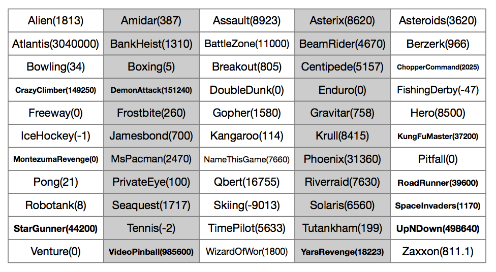

## Reproduce A2C with PARL
Based on PARL, the A2C algorithm of deep reinforcement learning has been reproduced, reaching the same level of indicators as the paper in Atari benchmarks.

A2C is a synchronous, deterministic variant of [Asynchronous Advantage Actor Critic (A3C)](https://arxiv.org/abs/1602.01783). Instead of updating asynchronously in A3C or GA3C, A2C uses a synchronous approach that waits for each actor to finish its sampling before performing an update. Since loss definition of these A3C variants are identical, we use a common a3c algotrithm `parl.algorithms.A3C` for A2C and GA3C examples.

### Atari games introduction
Please see [here](https://gym.openai.com/envs/#atari) to know more about Atari games.

### Benchmark result
Mean episode reward in training process after 10 million sample steps.


Performance of A2C on various envrionments

<p align="center">

</p>


## How to use
### Dependencies
+ [paddlepaddle==1.8.5](https://github.com/PaddlePaddle/Paddle)
+ [parl<2.0.0](https://github.com/PaddlePaddle/PARL)
+ gym==0.12.1
+ atari-py==0.1.7


### Distributed Training

At first, We can start a local cluster with 5 CPUs:

```bash
xparl start --port 8010 --cpu_num 5
```

Note that if you have started a master before, you don't have to run the above
command. For more information about the cluster, please refer to our
[documentation](https://parl.readthedocs.io/en/latest/parallel_training/setup.html)

Then we can start the distributed training by running:

```bash
python train.py
```

### Reference
+ [Parl](https://parl.readthedocs.io/en/latest/parallel_training/setup.html)
+ [Ray](https://github.com/ray-project/ray)
+ [OpenAI Baselines: ACKTR & A2C](https://openai.com/blog/baselines-acktr-a2c/)
