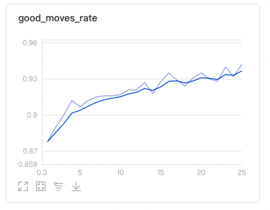
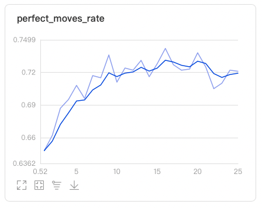

Dependencies
* python3
* paddle
* parl
* tqdm

### Training 

1. Download the [1k connect4 validation set](https://www.kaggle.com/petercnudde/1k-connect4-validation-set) to the current directory. (filename: `refmoves1k_kaggle`)

2. Start xparl cluster

```bash
# You can change following `cpu_num` and `args.actor_nums` in the main.py 
# based on the CPU number of your machine.

xparl start --port 8010 --cpu_num 25
```

```bash
# [OPTIONAL] You can also run the following script in other machines to add more CPU resource 
#            to the xparl cluster, so you can increase the parallelism (args.actor_nums).

xparl connect --address MASTER_IP:8010 --cpu_num [CPU_NUM]
```

3. Run training script

```bash
python main.py
```

4. Visualize (good moves rate and perfect moves rate)

```
visualdl --logdir .
```


### Performance

- Following are `good moves rate` and `perfect moves rate` indicators in visualdl, please refer to the [link](https://www.kaggle.com/petercnudde/scoring-connect-x-agents) for specific meaning.

 

> It takes about 2 day to run 25 iterations on the machine with 5 cpus.

### Play with AI
Pit the best model against human being.
```
python connect4_aiplayer.py 
```

### Reference

- [suragnair/alpha-zero-general](https://github.com/suragnair/alpha-zero-general)