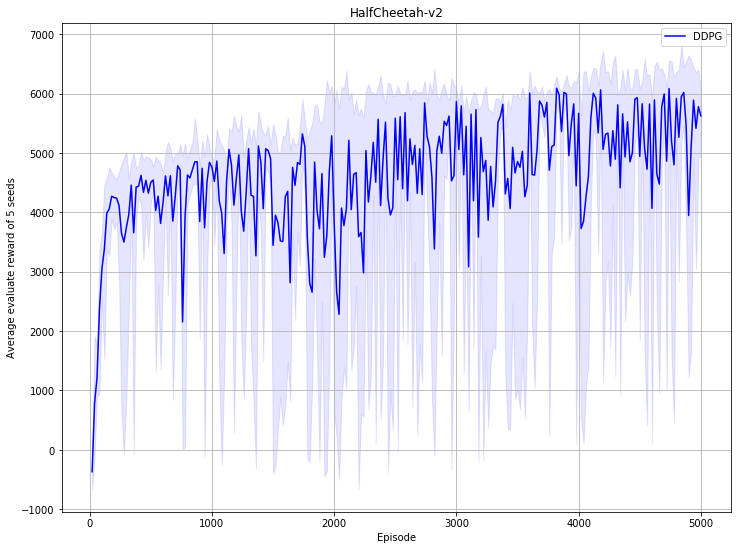
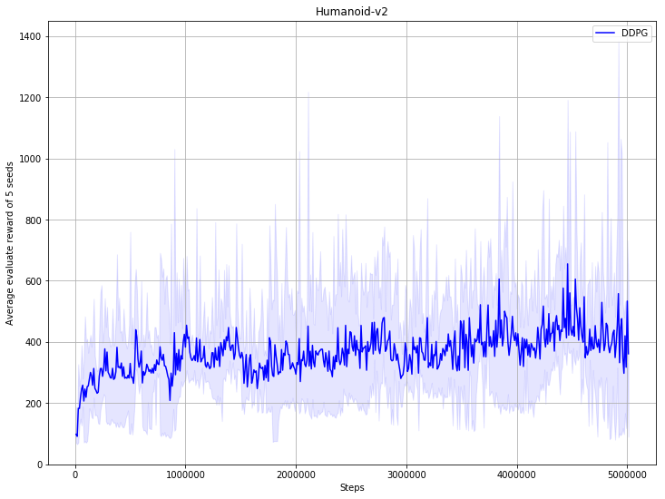
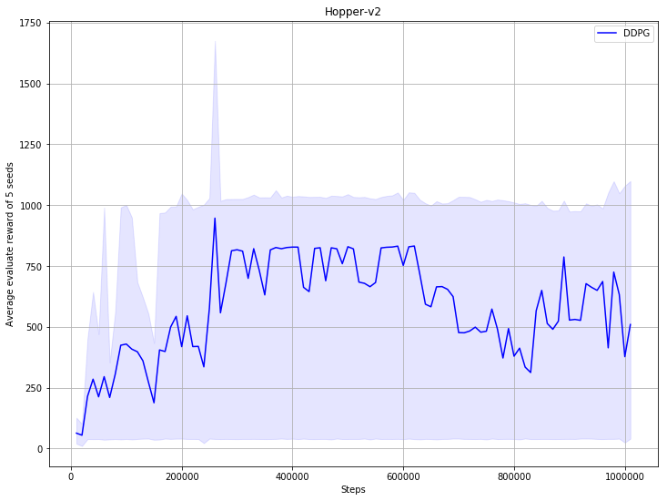

## Reproduce DDPG with PARL
Based on PARL, the DDPG algorithm of deep reinforcement learning has been reproduced, reaching the same level of indicators as the paper in Atari benchmarks.

> Paper: DDPG in [Continuous control with deep reinforcement learning](https://arxiv.org/abs/1509.02971)

### Mujoco games introduction
Please see [here](https://github.com/openai/mujoco-py) to know more about Mujoco games.

### Benchmark result

   


## How to use
### Dependencies:
+ python3.5+
+ [paddlepaddle==1.8.5](https://github.com/PaddlePaddle/Paddle)
+ [parl<2.0.0](https://github.com/PaddlePaddle/PARL)
+ gym
+ tqdm
+ mujoco-py>=1.50.1.0

### Start Training:
```
# To train an agent for HalfCheetah-v2 game
python train.py

# To train for other game
# python train.py --env [ENV_NAME]
