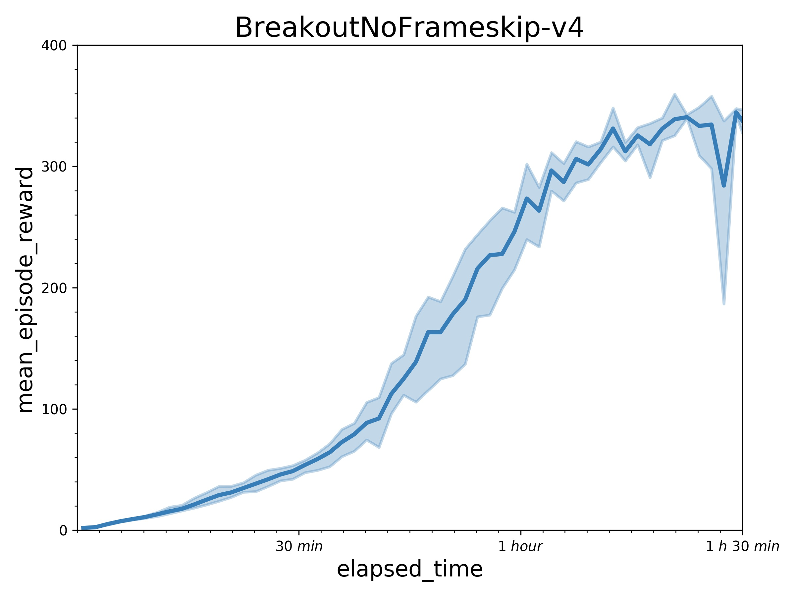
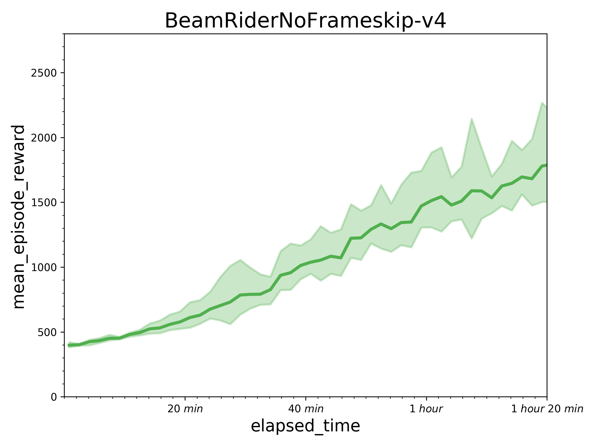
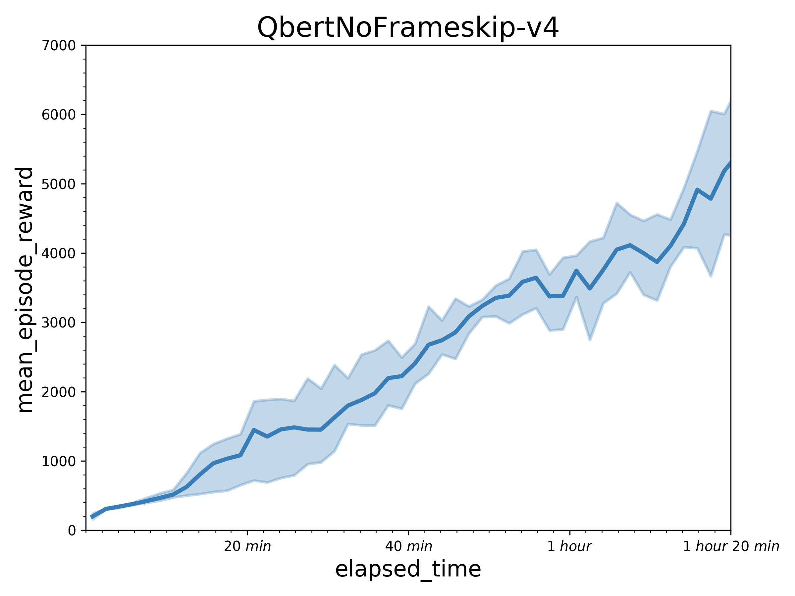
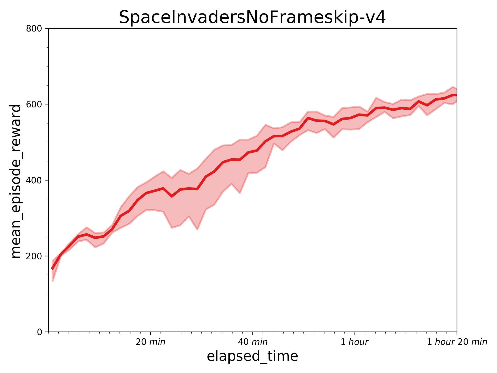

## Reproduce GA3C with PARL
Based on PARL, the GA3C algorithm of deep reinforcement learning has been reproduced, reaching the same level of indicators as the paper in Atari benchmarks.

Original paper: [GA3C: GPU-based A3C for Deep Reinforcement Learning](https://www.researchgate.net/profile/Iuri_Frosio2/publication/310610848_GA3C_GPU-based_A3C_for_Deep_Reinforcement_Learning/links/583c6c0b08ae502a85e3dbb9/GA3C-GPU-based-A3C-for-Deep-Reinforcement-Learning.pdf)

A hybrid CPU/GPU version of the [Asynchronous Advantage Actor-Critic (A3C)](https://arxiv.org/abs/1602.01783) algorithm.

### Atari games introduction
Please see [here](https://gym.openai.com/envs/#atari) to know more about Atari games.

### Benchmark result
Results with one learner (in a P40 GPU) and 24 simulators (in 12 CPU) in 10 million sample steps.
 
 


## How to use
### Dependencies
+ [paddlepaddle==1.8.5](https://github.com/PaddlePaddle/Paddle)
+ [parl<2.0.0](https://github.com/PaddlePaddle/PARL)
+ gym==0.12.1
+ atari-py==0.1.7

### Distributed Training

At first, We can start a local cluster with 24 CPUs:

```bash
xparl start --port 8010 --cpu_num 24
```

Note that if you have started a master before, you don't have to run the above
command. For more information about the cluster, please refer to our
[documentation](https://parl.readthedocs.io/en/latest/parallel_training/setup.html)

Then we can start the distributed training by running:

```bash
python train.py
```

[Tips] The performance can be influenced dramatically in a slower computational
environment, especially when training with low-speed CPUs. It may be caused by
the policy-lag problem.

### Reference
+ [Parl](https://parl.readthedocs.io/en/latest/parallel_training/setup.html)
+ [tensorpack](https://github.com/tensorpack/tensorpack)
