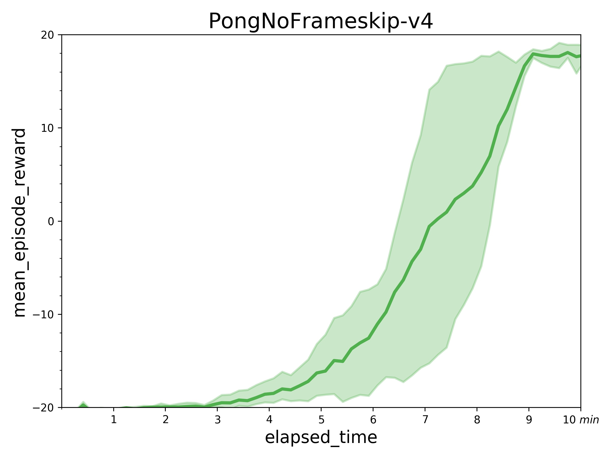
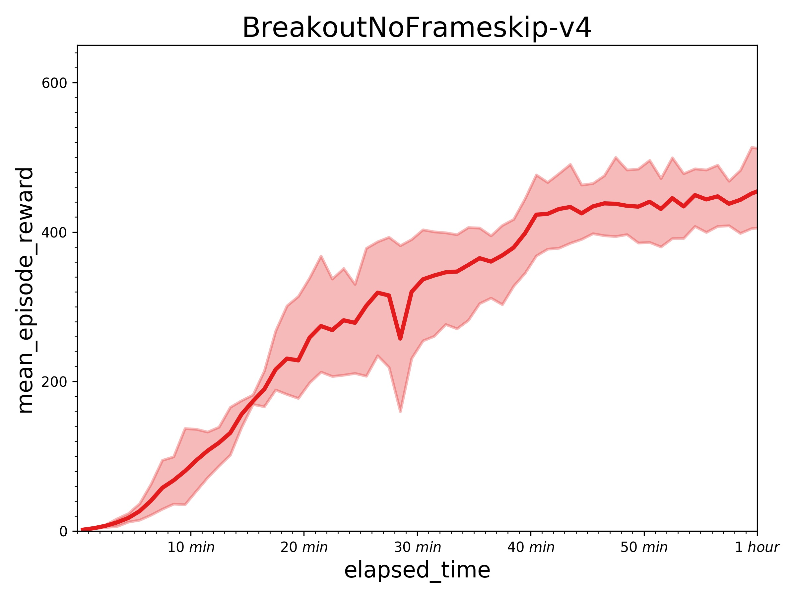
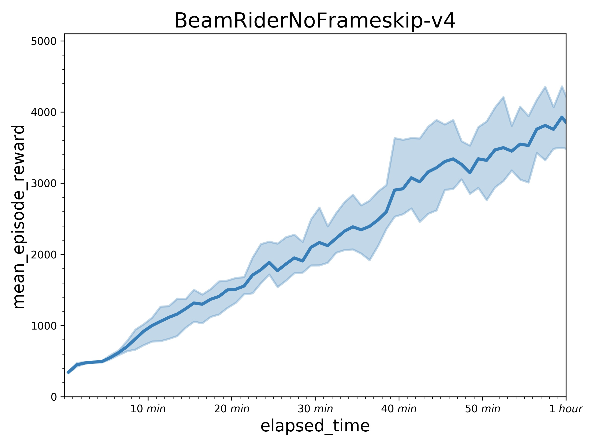
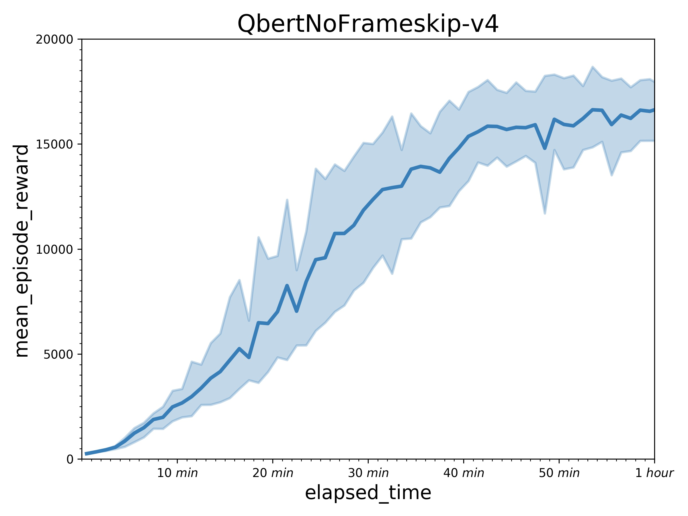
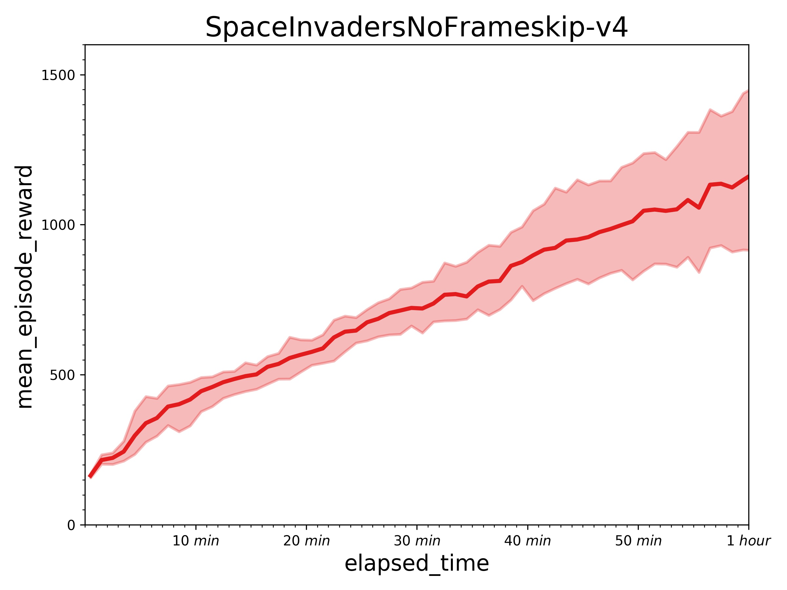

## Reproduce IMPALA with PARL
Based on PARL, the IMPALA algorithm of deep reinforcement learning is reproduced, and the same level of indicators of the paper is reproduced in the classic Atari game.

> Paper: IMPALA in [Impala: Scalable distributed deep-rl with importance weighted actor-learner architectures](https://arxiv.org/abs/1802.01561)

### Atari games introduction
Please see [here](https://gym.openai.com/envs/#atari) to know more about Atari games.

### Benchmark result
Result with one learner (in a P40 GPU) and 32 actors (in 32 CPUs).
+ PongNoFrameskip-v4: mean_episode_rewards can reach 18-19 score in about 7~10 minutes.


+ Results of other games in an hour.

 
<br>
 

## How to use
### Dependencies
+ [paddlepaddle==1.8.5](https://github.com/PaddlePaddle/Paddle)
+ [parl<2.0.0](https://github.com/PaddlePaddle/PARL)
+ gym==0.12.1
+ atari-py==0.1.7

### Distributed Training:

At first, We can start a local cluster with 32 CPUs:

```bash
xparl start --port 8010 --cpu_num 32
```

Note that if you have started a master before, you don't have to run the above
command. For more information about the cluster, please refer to our
[documentation](https://parl.readthedocs.io/en/latest/parallel_training/setup.html)

Then we can start the distributed training by running:

```bash
python train.py
```

### Reference
+ [Parl Cluster Setup](https://parl.readthedocs.io/en/latest/parallel_training/setup.html).
+ [deepmind/scalable_agent](https://github.com/deepmind/scalable_agent)
+ [Ray](https://github.com/ray-project/ray)
