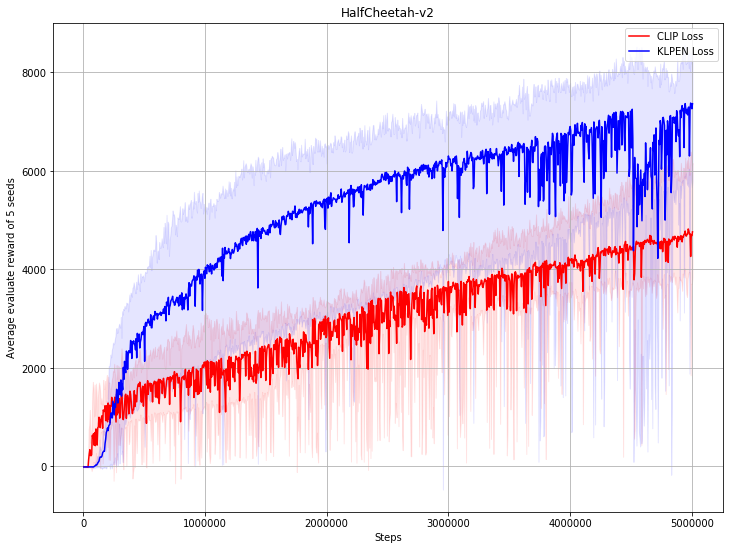
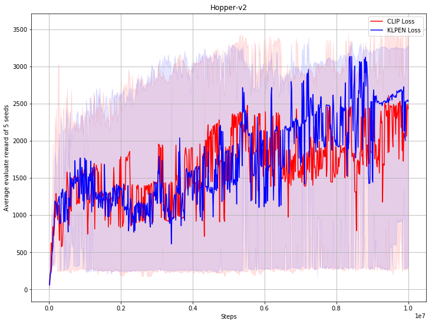

## Reproduce PPO with PARL
Based on PARL, the PPO algorithm of deep reinforcement learning has been reproduced, reaching the same level of indicators as the paper in Atari benchmarks.

Include following approach:
+ Clipped Surrogate Objective
+ Adaptive KL Penalty Coefficient

> Paper: PPO in [Proximal Policy Optimization Algorithms](https://arxiv.org/abs/1707.06347)

### Mujoco games introduction
Please see [here](https://github.com/openai/mujoco-py) to know more about Mujoco games.

### Benchmark result

    

## How to use
### Dependencies:
+ python3.5+
+ [paddlepaddle==1.8.5](https://github.com/PaddlePaddle/Paddle)
+ [parl<2.0.0](https://github.com/PaddlePaddle/PARL)
+ gym
+ tqdm
+ mujoco-py>=1.50.1.0

### Start Training:
```
# To train an agent for HalfCheetah-v2 game (default: CLIP loss)
python train.py

# To train for different game and different loss type
# python train.py --env [ENV_NAME] --loss_type [CLIP|KLPEN]
