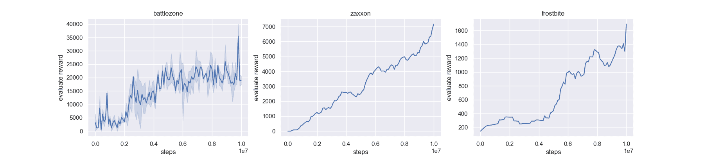

## Prioritized Experience Replay
Reproducing paper [Prioritized Experience Replay](https://arxiv.org/abs/1511.05952).

Prioritized experience replay (PER) develops a framework for prioritizing experience, so as to replay important transitions more frequently. There are two variants of prioritizing the transitions, rank-based and proportional-based. Our implementation is the proportional variant, which has a better performance, as reported in the original paper.

## Reproduced Results
Results have been reproduced with [Double DQN](https://arxiv.org/abs/1509.06461v3) on following three environments:

<p align="center">
  
</p>

## How to use

### Dependencies:
+ [paddlepaddle==1.8.5](https://github.com/PaddlePaddle/Paddle)
+ [parl<2.0.0](https://github.com/PaddlePaddle/PARL)
+ gym[atari]==0.17.2
+ atari-py==0.2.6
+ tqdm
+ [ale_python_interface](https://github.com/mgbellemare/Arcade-Learning-Environment)


### Start Training:
Train on BattleZone game:
```bash
python train.py --rom ./rom_files/battle_zone.bin
```

> To train on more games, you can install more rom files from [here](https://github.com/openai/atari-py/tree/master/atari_py/atari_roms).
