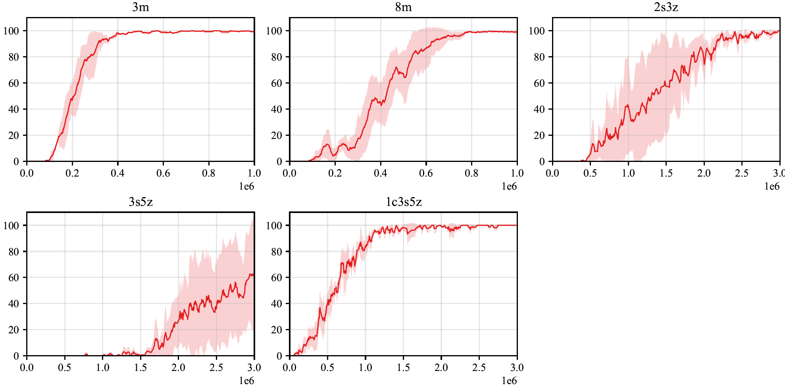

## QMIX based on PARL and PaddlePaddle
We reproduce the QMIX based on **PARL** and **PaddlePaddle**, reaching the same level of indicators as the paper in StarCraft2 benchmarks.
### QMIX
QMIX is a **value-based** multi-agent reinforcement learning algorithm.  
Learn more about QMIX from: [QMIX: Monotonic Value Function Factorisation for Deep Multi-Agent Reinforcement Learning](https://arxiv.org/abs/1803.11485)
### StarCraft2 Environment
Paper: [The StarCraft Multi-Agent Challenge](https://arxiv.org/pdf/1902.04043)  
Github Repositories: [smac](https://github.com/oxwhirl/smac)  
## Benchmark Results
  

- We trained our model in 5 different scenarios: *"3m", "8m", "2s_3z", "3s_5z"* and *"1c_3s_5z"*.
- The **difficulty** in all scenarios are set to be "7" (very difficult).  
- We trained our model 3 times for each scenario.

## How to Use
### Dependencies
+ python3.5+
- [PaddlePaddle==1.8.5](https://github.com/PaddlePaddle/Paddle)
- [parl<2.0.0](https://github.com/PaddlePaddle/PARL)
- [smac](https://github.com/oxwhirl/smac)

### Start Training
1. Modify the config in `qmix_config.py`.
2. Start training:
    ```bash
    python train.py
    ```
3. View the training process with tensorboard:
    ```bash
    tensorboard --logdir ./
    ```
