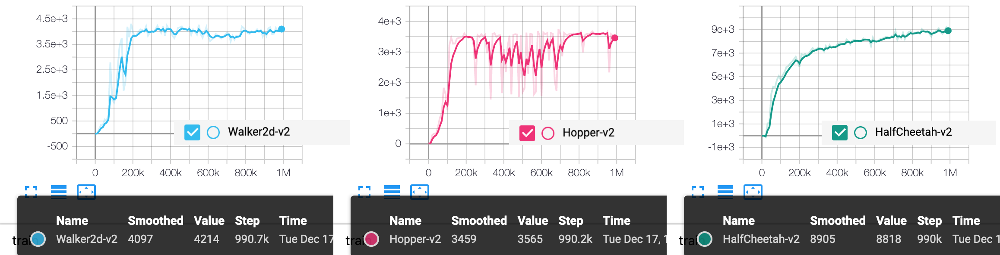

## Reproduce SAC with PARL
Based on PARL, the SAC algorithm of deep reinforcement learning has been reproduced, reaching the same level of indicators as the paper in Mujoco benchmarks.

Include following approaches:
+ DDPG Style with Stochastic Policy
+ Maximum Entropy

> Paper: SAC in [Soft Actor-Critic: Off-Policy Maximum Entropy Deep Reinforcement Learning with a Stochastic Actor](https://arxiv.org/abs/1801.01290)

### Mujoco games introduction
Please see [here](https://github.com/openai/mujoco-py) to know more about Mujoco games.

### Benchmark result



## How to use
### Dependencies:
+ python3.5+
+ [paddlepaddle==1.8.5](https://github.com/PaddlePaddle/Paddle)
+ [parl<2.0.0](https://github.com/PaddlePaddle/PARL)
+ gym
+ mujoco-py>=1.50.1.0

### Start Training:
```
# To train an agent for HalfCheetah-v2 game
python train.py

# To train for different games
# python train.py --env [ENV_NAME]
