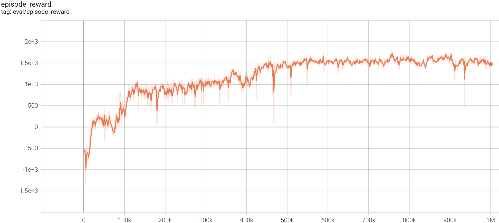

# RL_CARLA
## Carla_SAC Experiment
Run SAC algorithm in Carla Environment with [PaddlePaddle](https://github.com/PaddlePaddle/Paddle)
and [parl](https://github.com/PaddlePaddle/PARL) for distributed training.

### System
+ Ubuntu 16.04
### Env
+ [carla-simulator](https://github.com/carla-simulator/carla/releases/tag/0.9.6)
+ gym_carla
### SAC Algorithm
> Paper: SAC in [Soft Actor-Critic: Off-Policy Maximum Entropy Deep Reinforcement Learning with a Stochastic Actor](https://arxiv.org/abs/1801.01290)

### Benchmark result



+ Result was run with seed `0`, mode `Lane`

### Installation
1. Create conda environment
    ```env
    $ conda create -n rl_carla python=3.6
    $ conda activate rl_carla
    ```
2. Clone repository from [parl](https://github.com/PaddlePaddle/PARL) to some folder
    ```clone
    $ git clone https://github.com/ShuaibinLi/PARL.git
    ```
3. Install the packages
    ```
    $ cd PARL/benchmark/paddle/CARLA_SAC
    $ pip install -r requirements.txt
    $ pip install -e .
    ```
4. Download [CARLA_0.9.6](https://github.com/carla-simulator/carla/releases/tag/0.9.6), 
   extract it to some folder, and add CARLA to `PYTHONPATH` environment variable
   ```
   $ export PYTHONPATH="SOMEFOLDER/CARLA_0.9.6/PythonAPI/carla/dist/carla-0.9.6-py3.5-linux-x86_64.egg:$PYTHONPATH"
   ```
#### Start Training
1. Enter the CARLA root folder, launch the CARLA server in different terminals 
   with non-display mode
    ```start env
    $ DISPLAY= ./CarlaUE4.sh -opengl -carla-port=2020
    $ DISPLAY= ./CarlaUE4.sh -opengl -carla-port=2021
    $ DISPLAY= ./CarlaUE4.sh -opengl -carla-port=2022
    $ DISPLAY= ./CarlaUE4.sh -opengl -carla-port=2023
    ```
   or with display mode
   ```start_env
   $ ./CarlaUE4.sh -windowed -carla-port=2023
   ```
   + Three environments(2020,2021,2022) for collecting data and training, 
     one environment(2023) for evaluating.
   
2. Open a new terminal and start [parl](https://github.com/PaddlePaddle/PARL) port for parallelization by
   ```Parallelization
   $ xparl start --port 8765
   ```
   checkout xparl connect --address in the terminal

3. Enter the cloned repository
   ```train
   python train.py ----localhost [xparl address]
   
   # Train for other settings
   python train.py ----localhost [xparl address] --seed [int] --task_mode [mode]
   ```
#### Rerun trained agent
```load
$ python evaluate.py
```