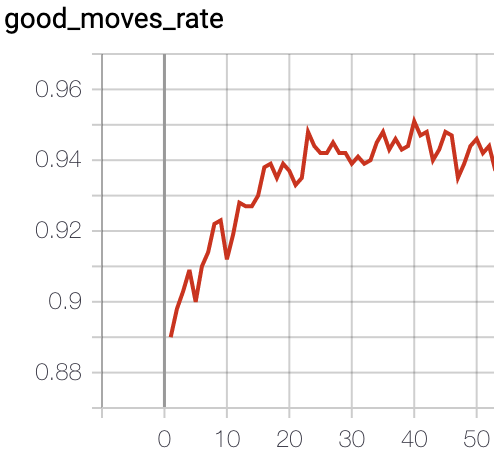
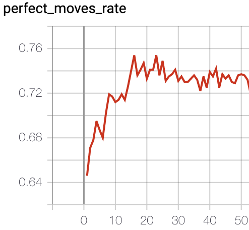

## AlphaZero baseline for Connect4 game (distributed version)
- In this example, we provide a fine-tuned AlphaZero baseline to solve the Connect4 game, based on the code of [alpha-zero-general](https://github.com/suragnair/alpha-zero-general) repo.
- We take advantage of the parallelism capacity of [PARL](https://github.com/PaddlePaddle/PARL) to support running self-play and evaluating tasks in parallel.
- We also provide scripts to pack your well-trained model to a submission file, which can be submitted to the Kaggle [Connect X](https://www.kaggle.com/c/connectx/leaderboard) competition directly.

### Dependencies
- python3
- [parl>=1.4](https://github.com/PaddlePaddle/PARL)
- torch
- tqdm

### Training 
1. Download the [1k connect4 validation set](https://www.kaggle.com/petercnudde/1k-connect4-validation-set) to the current directory. (filename: `refmoves1k_kaggle`)

2. Start xparl cluster
```bash
# You can change following `cpu_num` and `args.actor_nums` in the main.py 
# based on the CPU number of your machine.

xparl start --port 8010 --cpu_num 25
```

```bash
# [OPTIONAL] You can also run the following script in other machines to add more CPU resource 
#            to the xparl cluster, so you can increase the parallelism (args.actor_nums).

xparl connect --address MASTER_IP:8010 --cpu_num [CPU_NUM]
```

3. Run training script
```bash
python main.py
```

4. Visualize (good moves rate and perfect moves rate)
```
tensorboard --logdir .
```

### Submitting
To submit the well-trained model to the Kaggle, you can use our provided script to generate `submission.py`, for example:
```bash
python gen_submission.py saved_model/best.pth.tar
```

### Performance
- Following are `good moves rate` and `perfect moves rate` indicators in tensorbaord, please refer to the [link](https://www.kaggle.com/petercnudde/scoring-connect-x-agents) for specific meaning.

 

> It takes about 1 day to run 25 iterations on the machine with 25 cpus.

- It can reach about score 1368 (rank 5 on 2020/06/04) in the Kaggle [Connect X](https://www.kaggle.com/c/connectx/leaderboard) competition.


### Reference
- [suragnair/alpha-zero-general](https://github.com/suragnair/alpha-zero-general)
- [Scoring connect-x agents](https://www.kaggle.com/petercnudde/scoring-connect-x-agents)
