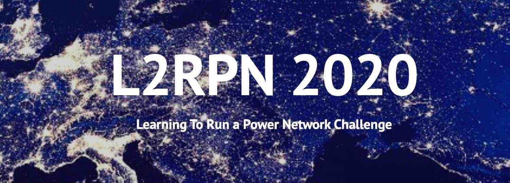

## NeurIPS2020 L2RPN Challenge

The **PARL** team gets the first place for all tracks (both Robustness Track and Adaptability Track) in *NeurIPS2020 Learning-to-Run-a-Power-Network* challenge! 

## Note
We release the code with trained policy for our top submission at the moment. Regarding the training the code, we are still working on a technical report and will release it as soon as possible.
