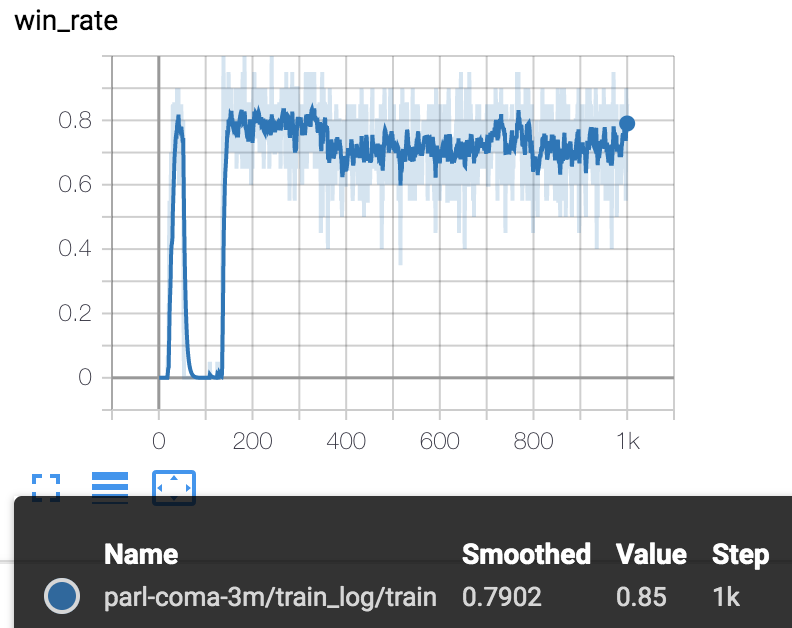

## Reproduce COMA with PARL

This is an PARL + PyTorch implementation of the multi-agent reinforcement learning algorithms: COMA.

### Paper
- [Counterfactual Multi-Agent Policy Gradients](https://arxiv.org/abs/1705.08926)

### Benchmark Result
Mean win_rate (evaluate 5 episode) for 1000 epchos training (1 epcho = 5 episodes).




## StarCraft II Installation
The environment is based on the full game of StarCraft II (version >= 3.16.1). To install the game, follow the commands bellow, or check more detail in [SMAC](https://github.com/oxwhirl/smac#installing-starcraft-ii). MacOS/Windows users are required to run this folder in Docker, as the starcraft environment does not support these two systems.

### Linux
```shell
$ cd starcraft2
$ SC2PATH=~ bash install_sc2.sh
```
### MacOS (use Docker)
```shell
$ cd starcraft2
$ bash build_docker.sh  # build Dockerfile
$ bash install_sc2.sh  # download startcraft II and maps
```
### Windows (use Docker)
- Step 1: Build docker images, `cd starcraft2 && bash build_docker.sh`
- Step 2: Download a [Starcraft II package](https://github.com/Blizzard/s2client-proto#linux-packages), unzip to folder `starcraft2/StarCraftII` (password: `iagreetotheeula`)
- Step 3: Download [Map](https://github.com/oxwhirl/smac/releases/download/v0.1-beta1/SMAC_Maps.zip), unzip to folder `starcraft2/StarCraftII/Maps/SMAC_Maps`


## How to use
### Dependencies
- python3.5+
- parl
- torch
- [SMAC](https://github.com/oxwhirl/smac)

### Start Training
#### Linux
```shell
$ python3 train.py
```
#### MacOS/Windows (use Docker)
```shell
$ cd coma
$ NV_GPU=$your_gpu_id docker run --name $your_container_name --user $(id -u):$(id -g) -v `pwd`:/parl -t parl-starcraft2:1.0 python3 train.py
```
*or you can operate docker interactively by `docker run --name $your_container_name -it -v $your_host_path:/parl -t parl-starcraft2:1.0  /bin/bash`*


### Reference
- [StarCraft](https://github.com/starry-sky6688/StarCraft)
- [pymarl](https://github.com/oxwhirl/pymarl)
