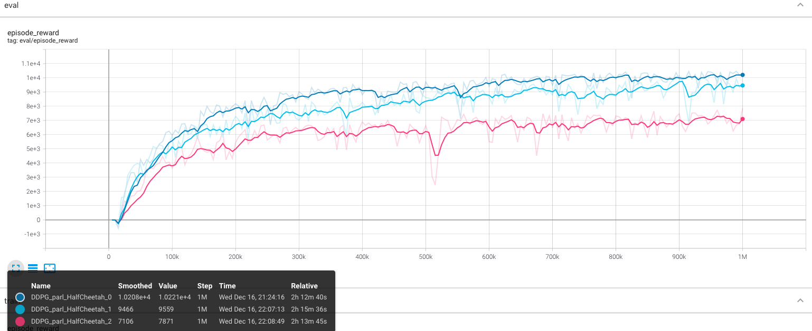

## Reproduction DDPG with PARL
Based on PARL, the DDPG algorithm of DRL has been reproduced, reaching the same level of indicators as the paper in Mujoco benchmarks.

>Paper: DDPG in [Continuous control with deep reinforcement learning](https://arxiv.org/abs/1509.02971)

About DDPG
+ A model-free, off-policy algorithm.
+ Can only be used for env with continuous action spaces.
+ An continuous thought of DQN.

### Mujoco game introduction
Please see [here](https://github.com/openai/mujoco-p) to know more about Mujoco games.

## Benchmark result in HalfCheetah-v1




## How to use
### Denpendencies:
+ python
+ [parl](https://github.com/PaddlePaddle/PARL)
+ gym
+ torch
+ mujoco-py>=1.50.1.0

### Start Training:
```
# To train an agent for HalfCheetah-v1 game
python train.py

# To train for other games
# python train --env [env_namne]
```

