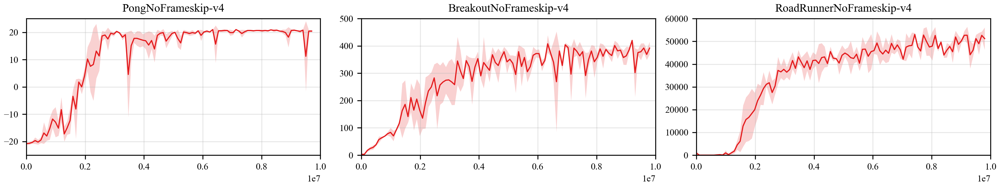

## Reproduce DQN with PARL
Based on PARL, the DQN algorithm of deep reinforcement learning has been reproduced, reaching the same level of indicators as the paper in Atari benchmarks.

+ Papers: 

> DQN in [Human-level Control Through Deep Reinforcement Learning](http://www.nature.com/nature/journal/v518/n7540/full/nature14236.html)

> DDQN in [Deep Reinforcement Learning with Double Q-learning](https://arxiv.org/abs/1509.06461)

> Dueling DQN in [Dueling Network Architectures for Deep Reinforcement Learning](https://arxiv.org/abs/1511.06581)

### Atari games introduction
Please see [here](https://gym.openai.com/envs/#atari) to know more about Atari games.

### Benchmark results

*Benchmark results are obtained using different random seeds.*

Performance of **DQN** on various environments:

<p align="center">

</p>

Performance of **Dueling DQN** on 55 Atari environments:

|                     |                      |                      |                    |                 |
|---------------------|----------------------|----------------------|--------------------|-----------------|
|Alien (2390)         | Amidar (468)         | Assault (13898)      |Asterix (24067)     | Asteroids (450)  |
|Atlantis (136833)    | WizardOfWor (1767)   | BankHeist (953)      |BattleZone (26667)  | BeamRider (9771) |
|Berzerk (531)        | Bowling (30)         | Boxing (100)         |Breakout (531)      | Centipede (7416) |
|ChopperCommand (1533)| CrazyClimber (102072)| DemonAttack (83478)  |DoubleDunk (0)      | Enduro (1634)    |
|FishingDerby (26)    | Freeway (32)         | Frostbite (4803)     |Gopher (8128)       | Gravitar (83)    |
|Hero (11810)         | IceHockey (-3)       | Jamesbond (616)      |Kangaroo (4900)     | Krull (8789)     |
|KungFuMaster (33144) | MontezumaRevenge (0) | MsPacman (2873)      |NameThisGame (15010)| Phoenix (14837)  |
|Pitfall (0)          | Pong (21)            | PrivateEye (100)     |Qbert (4850)        | Riverraid (12453)|
|RoadRunner (58000)   | Robotank (26)        | Seaquest (5960)      |Skiing (-10584)     | Solaris (347)    |
|SpaceInvaders (2068) | StarGunner (22100)   | Tennis (1)           |TimePilot (2967)    | Tutankham (132)  |
|UpNDown (12350)      | Venture (0)          | VideoPinball (876611)|YarsRevenge (30281) | Zaxxon (4400)    |

## How to use
### Dependencies:
+ python>=3.6.2
+ [pytorch==1.7.1](https://pytorch.org/get-started/previous-versions/)
+ [parl](https://github.com/PaddlePaddle/PARL)
+ gym==0.18.0
+ tqdm
+ atari-py==0.2.6

### Start Training:
```
# To train a model for Pong game
python train.py

# For more customized arguments
python train.py --help
```
