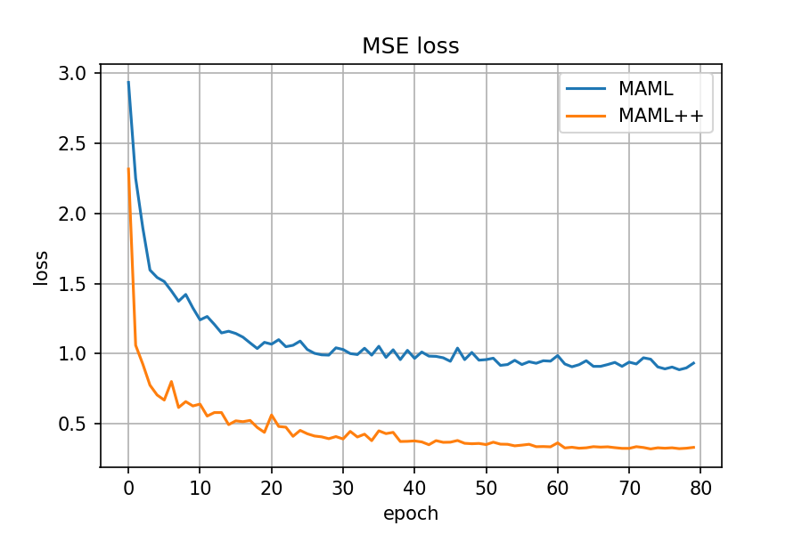

# Regression MAML/MAML++ with PARL
Implementation of [MAML](https://arxiv.org/abs/1703.03400) and [MAML++](https://arxiv.org/abs/1810.09502) with PyTorch and PARL that works for regression tasks. 

## Benchmark result

We follow the regression task setting from [Meta-SGD](https://arxiv.org/pdf/1707.09835.pdf), where the model is going to learn different sine waves. The figure below shows the test losses of MAML and MAML++ on 10000 randomly generated sine waves.

| MAML(from Meta-SGD) | Mate-SGD(from Meta-SGD) | MAML (ours) | MAML++ (ours)|
| --- | --- | --- | --- |
| 1.13&plusmn;0.18 |0.90&plusmn;0.16|  0.90&plusmn;0.06 | 0.34&plusmn;0.04 |

## How to use

### Dependencies:

+ python>=3.8.9
+ pytorch==1.7.1
+ parl
+ gym==0.9.2
+ mujoco-py==0.5.7

### Start Training:

~~~
python3 train.py
~~~

