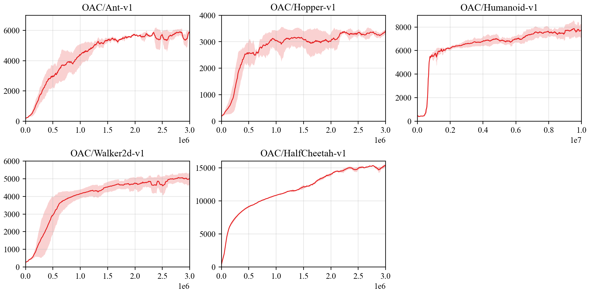

## Reproduce OAC with PARL
Based on PARL, the OAC algorithm of deep reinforcement learning has been reproduced, reaching the same level of indicators as the paper in Mujoco benchmarks.

> Paper: OAC in [Better Exploration with Optimistic Actor-Critic](https://arxiv.org/abs/1910.12807)

### Mujoco games introduction
Please see [here](https://github.com/openai/mujoco-py) to know more about Mujoco games.

### Benchmark result



+ Each experiment was run three times with different seeds

## How to use
### Dependencies:
+ python3.5+
+ [parl](https://github.com/PaddlePaddle/PARL)
+ gym==0.9.1
+ torch
+ mujoco-py==0.5.7

### Start Training:
```train
# To train an agent for HalfCheetah-v1 game
python train.py

# To train for other game & params
python train.py --env [ENV_NAME] --alpha [float] --beta [float] --delta [float]
```

### Reference
+ [microsoft/oac-explore](https://github.com/microsoft/oac-explore)
