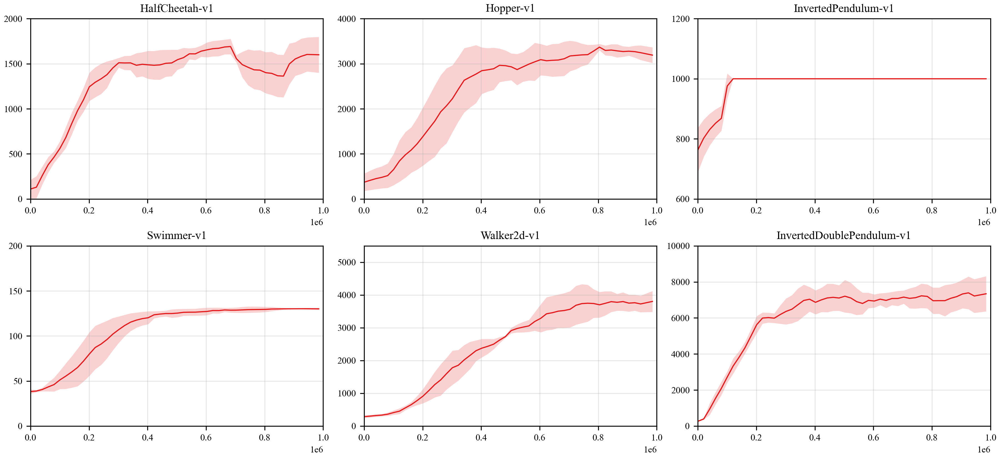

## Reproduce PPO with PARL
Based on PARL, the PPO algorithm of deep reinforcement learning has been reproduced, reaching the same level of indicators as the paper in mujoco benchmarks.

> Paper: PPO in [Proximal Policy Optimization Algorithms](https://arxiv.org/abs/1707.06347)

### Mujoco games introduction
Please see [here](https://github.com/openai/mujoco-py) to know more about Mujoco games.

### Benchmark result

<p align="center">

</p>

## How to use
### Dependencies:
+ python>=3.6.2
+ [pytorch==1.7.1](https://github.com/PaddlePaddle/Paddle)
+ [parl](https://github.com/PaddlePaddle/PARL)
+ gym==0.9.2
+ mujoco-py==0.5.7

### Start Training:
```
# To train an agent for Hopper-v1 game
python train.py

# For more customized arguments
# python train.py --help
