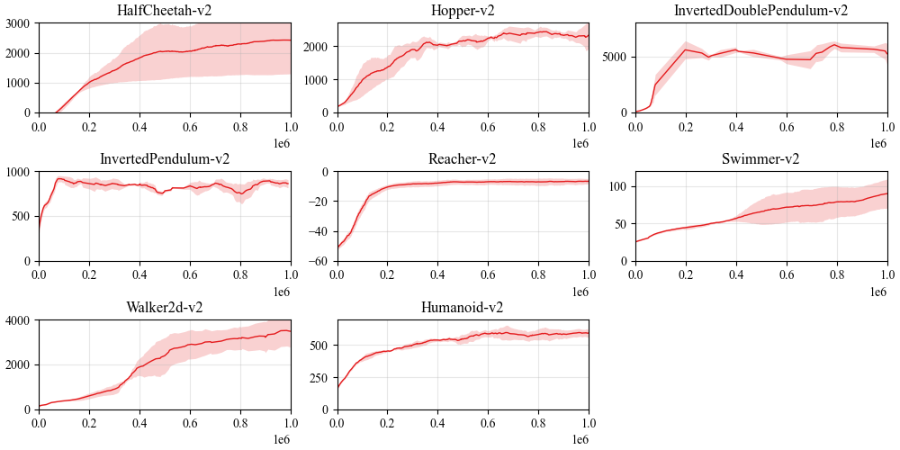
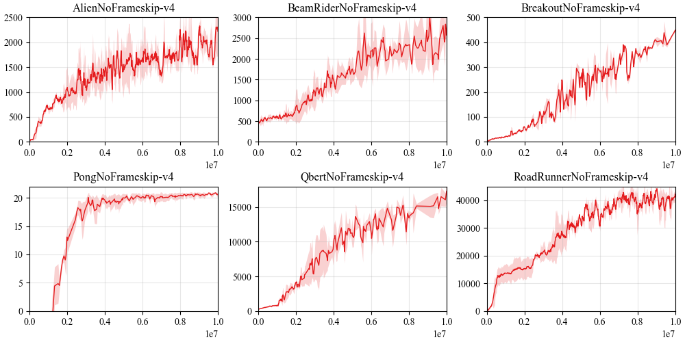

## Reproduce PPO with PARL
Based on PARL, the PPO algorithm of deep reinforcement learning has been reproduced, reaching the same level of indicators as the paper in mujoco benchmarks.

> Paper: PPO in [Proximal Policy Optimization Algorithms](https://arxiv.org/abs/1707.06347)

### Mujoco/Atari games introduction
Please see [mujoco-py](https://github.com/openai/mujoco-py) to know more about Mujoco games or [atari](https://gym.openai.com/envs/#atari) to know more about Atari games.

### Benchmark result
#### 1. Mujoco games results


#### 2. Atari games results


+ Each experiment was run three times with different seeds

## How to use
### Dependencies:
+ python>=3.6.2
+ [parl](https://github.com/PaddlePaddle/PARL)
+ pytorch
+ gym==0.21.0
+ mujoco-py==2.1.2.14

### Local Training:

```
# To train an agent for continuous action game (Mujoco: HalfCheetah-v2 by default)
python train.py

# To train an agent for discrete action game (Atari)
python train.py --env 'BreakoutNoFrameskip-v4' --env_num 8 --continuous_action False

# For more customized arguments
# python train.py --help
```

### Distributed Training
Accelerate training process when `env_num > 1`.
To At first, we can start a local cluster with 5 CPUs:

```
xparl start --port 8010 --cpu_num 5
```

Note that if you have started a master before, you don't have to run the above
command. For more information about the cluster, please refer to our
[documentation](https://parl.readthedocs.io/en/latest/parallel_training/setup.html).

Then we can start the distributed training by running:

```
python train.py --env 'BreakoutNoFrameskip-v4' --env_num 8 --continuous_action False --xparl_addr 'localhost:8010'
```
