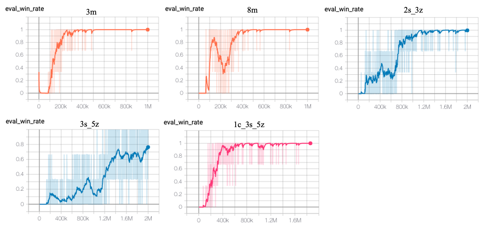

## QMIX based on Pytorch
We reproduce the QMIX based on **PARL** and **Pytorch**, reaching the same level of indicators as the paper in StarCraftII benchmarks.
## QMIX
QMIX is a **value-based** multi-agent reinforcement learning algorithm.  
See more information about QMIX in: [QMIX: Monotonic Value Function Factorisation for Deep Multi-Agent Reinforcement Learning](https://arxiv.org/abs/1803.11485)
## StarCraftII Environment
Paper: [The StarCraft Multi-Agent Challenge](https://arxiv.org/pdf/1902.04043)  
Github Repositories: [smac](https://github.com/oxwhirl/smac)  
## Benchmark Results
We tested our model in 5 different scenarios: *"3m", "8m", "2s_3z", "3s_5z"* and *"1c_3s_5z"*.


## How to Use
### Dependencies
- python
- [parl](https://github.com/PaddlePaddle/PARL)
- [smac](https://github.com/oxwhirl/smac)
- Pytorch

## Start Training
1. Modify the config in `train.py`.
2. Start training:
    ```bash
    python train.py
    ```
3. View the training process with tensorboard:
    ```bash
    tensorboard --logdir ./
    ```