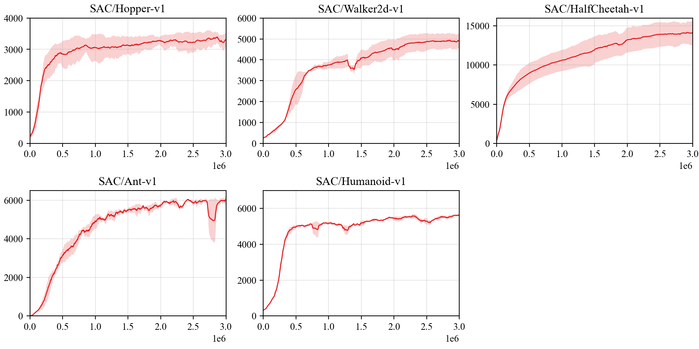

## Reproduce SAC with PARL
Based on PARL, the SAC algorithm of deep reinforcement learning has been reproduced, reaching the same level of indicators as the paper in Mujoco benchmarks.

> Paper: SAC in [Soft Actor-Critic: Off-Policy Maximum Entropy Deep Reinforcement Learning with a Stochastic Actor](https://arxiv.org/abs/1801.01290)

### Mujoco games introduction
Please see [here](https://github.com/openai/mujoco-py) to know more about Mujoco games.

### Benchmark result



+ Each experiment was run three times with different seeds

## How to use
### Dependencies:
+ python3.5+
+ [parl](https://github.com/PaddlePaddle/PARL)
+ gym==0.9.1
+ torch
+ mujoco-py==0.5.7

### Start Training:
#### Train
```
# To train for HalfCheetah-v1(default),Hopper-v1,Walker2d-v1,Ant-v1
# --alpha 0.2(default)
python train.py --env [ENV_NAME]

# To reproduce the performance of Humanoid-v1
python train.py --env Humanoid-v1 --alpha 0.05
