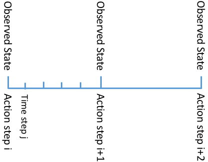
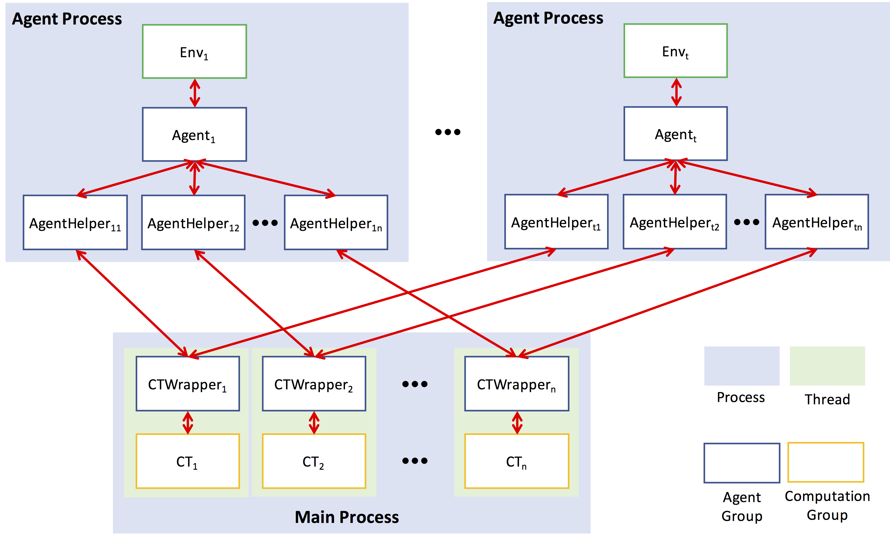
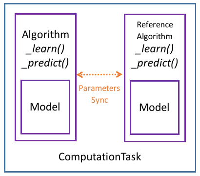
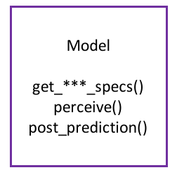
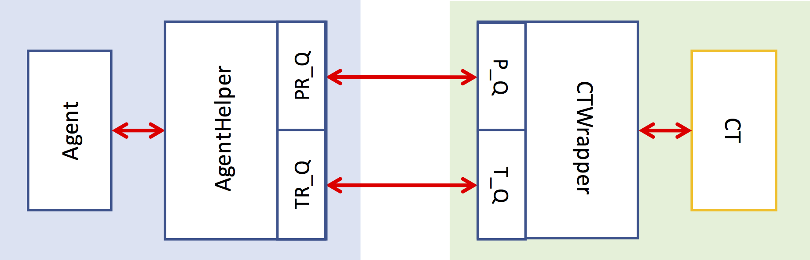

# PaddlePaddle Reinforcement Learning Framework (PARL)
This is the design doc for [PARL](https://github.com/PaddlePaddle/PARL)：a general-purpose RL platform based on PaddlePaddle Fluid. 

## Problem description

> A robot is an intelligent entity that situates in an environment. At every time step, it receives multimodal sensory inputs and generates (possibly multimodal) action outputs according to a certain set of rewards or goals, given the current (partial) environment observation.

Almost any RL problem can be seen in the above perspective. We can always convert a problem description to a one similar to the above (namely, where a robot takes actions in an environment at every time step and receives rewards).

For example, in the scenario of learning to put only one advertisement on each webpage, you can think of our decision-making algorithm as a robot, the user's online profile, browsing history, and some other contextual information as the environment observation, which advertisement to put on the webpage as the robot's action, and whether the user clicks on the advertisement as the reward. The time horizon in this case would then be a sequence of webpages. 

So it would be helpful to discuss any RL problem in this unified description.

#### Action step vs. time step
We need to differentiate between an *action step* and a *time step*. 

- A time step is a time interval defined by the environment simulator, which is the minimal temporal unit for simulation. Each time step yields a new environment observation. 
- An action step is always a multiple of a time step. If an actor has an action repetition of $K$, then an action step spans over $K$ time steps.

When $K>1$, between two adjacent action steps there are several environment observations. Usually the agent only gets the last environment observation while discarding the first $K-1$ ones. Below is a diagram for $K=5$.

<p align="center"></p>

In the following discussion, for simplicity we will assume $K=1$ and use the term "action step" and "time step" interchangeably. However, all the conclusions and designs easily apply to the cases of $K>1$.

## Representation of experience/sample
An experience or a sample received by the robot is a struct that has four fields:
- `inputs`: all the observed data at the current time step
- `states`: memory data storing the previous history; useful for problems having temporal dependencies
- `actions`: the actions taken by the robot at the time step
- `rewards`: a list of scalar rewards for taking the actions
- `game_over`: an integer value indicating the game-over status for the current time step
Note that here the `game_over` field indicates the current time step instead of the next time step. This is different with most standard open-source simulator packages (see OpenAI gym for an example).

## Robot Components

<p align="center"></p>
A **Robot** consists of some **computation tasks**, i.e., applying some **algorithms** to using or learning **models**. For example, a robot has one reinforcement learning task and it uses an Actor-Critic algorithm to learn the policy model. To provide additional training of the policy model, the robot can also have some auxiliary task which is usually dealt with by some unsupervised learning algorithm. Another scenario is where a robot needs different policies at different levels of temporal abstraction. In this case, we can assign one policy learning task to each policy. 

In the following, we describe the design details of  the above-mentioned major components of robot. The design principle is that we want to provide users with a framework that is easy for them to implement their own robots, by overriding or extending some of these components. The components of a robot can be divided into two groups. One group handles the actual models, e.g., model computation, parameter sharing and synchronization; we call it **computation group**. The other group interacts with environment and produce/consume data to/from *computation group*; we call it **agent group** (we will explain this name later).

Let's first talk about the components in **computation group**: `ComputationTask`, `Algorithm` and `Model`. 

### Computation Group

A robot consists of multiple `ComputationTask`s (CTs) executed in some order. Each CT can have its own data I/O interaction with outside. One CT may have I/O interaction with the other CTs. Intuitively, a ComputationTask should perform a relatively independent computation routine. For example, in hierarchical RL, one CT predicts the goal and the next CT predicts the actions according to the goal. We require that 

- The code between two CTs is non-differentiable computation or control.
- There is no gradient flowing between two adjacent CTs.

If you have two modules that must have gradients flow between them, then consider puting the two modules in one CT.
Finally, different CTs might have different time resolutions. For example, a CT outputs actions at every time step, which another CT outputs actions very 100 time steps.

<p align="center"></p>

***In the above figure, blue boxes represent pure Python logic control and computation, and purple boxes represent logic control and computation in Fluid programs.***

`ComputationTask` uses `Algorithm` to do the (back-end) network computatino. `Algorithm` implements general prediction and learning functions, independent of the actual tasks. An algorithm further contains a model which is problem-dependent and allows the user to write the front-end (data perception) of the network. 
The current usage of a reference algorithm is for behavior policy or delayed model update.

A `Model` specifies the network input/output specs, the perception function of the input data, and the post-processing function of the actions. It is usually varies for different problems.

Next, let's talk about the components in **agent group**: `Agent`, `AgentHelper` and `ComputationWrapper`. 

### Agent Group

<p align="center"></p>
<center>P_Q: prediction_q, PR_Q: prediction_return_q, T_Q: training_q, TR_Q: training_return_q</center>

`Agent` implements the control flow of robot's activities. At its simplest form, `Agent` provides an interface `run_one_episode()` where users can determine how `Agent` interacts with the environment `Simulator` and carries out `ComputationTask` with data from the `Simulator` or from the outcomes of other `ComputationTask`s.

`AgentHelper` abstracts the data preparation, data sampling and post-computation data processing of `Agent`. For example, `AgentHelper` maintains a replay buffer and handles the experience sampling for algorithms like DQN. Another purpose of `AgentHelper` is to hide the details of data communication with `ComputationTask` from `Agent`. For each `ComputationTask`, `Agent` binds it with one `AgentHelper`.

PARL supports parallel simulation, which means the robot can deploy multiple `Agent` that run independently. `ComputationTask` batches data from `Agent`s together and do the computation at one time. In practice, we use `ComputationWrapper` to abstract this I/O part. The communication between `AgentHelper`  and `ComputationWrapper` is handled by a simple class `Communicator`:

```python
class Communicator(object):
    def __init__(self, agent_id, training_q, prediction_q):
        self.agent_id = agent_id # the id of agent that uses it
        # reference to {training,prediction}_q of the ComputationWrapper that uses it
        self.{training,prediction}_q = {training,prediction}_q
        # used to accept data returned from ComputationTask's {training,prediction}
        self.{training,prediction}_return_q = Queue()
        
    def put_{training,prediction}_data(self, data):
        self.{training,prediction}_q.put((self.agent_id, data))
        
    def put_{training,prediction}_return(self, data):
        self.{training,prediction}_return_q.put(data)
        
    def get_{training,prediction}_return(self):
        return self.{training,prediction}_q.get()
```

The definition of `AgentHelper` can then be:

```python
class AgentHelper(object):
    def __init__(self):
        self.name # the name of the task this helper is bound to
        self.comm # Communicator
        self.exp_q # a container to store the past experience data
        
    def predict(self, inputs):
        """
        send data to ComputationTask for prediction; blocked until return
        """
        inputs = ... # some data processing of inputs
        self.comm.put_prediction_data(inputs)
        return self.comm.get_prediction_return()
        
    def store_data(self, data):
        """
        store the past experience data, and call learn() if necessary
        """
        self.exp_q.add(data)
        
    def learn(self):
        """
        send data to ComputationTask for learning; blocked until return
        """
        # some data preparation, for example:
        data = self.exp_q.sample()
        self.comm.put_training_data(data)
        return self.comm.get_training_return()
```

Note: depending on the situation, `AgentHelper.learn()` can be called by `Agent` or within `AgentHelper.store_data()`, or be invoked as a separate thread.

As an example, we demonstrate how to define an `Agent` whose robot uses hierarchical policies. The bottom goal-following "RL" policy is updated every `TRAINING_INTERVAL` steps and the top goal generation "goal" policy is updated every time the goal is achieved or aborted.

```python
class Agent(object):
    self.env # environment
    self.helpers = {'RL': OnPolicyHelper, 'goal': OffPolicyHelper} # a dictionary of AgentHelper
    
    def run_one_episode()
        obs = self.env.get_obs()
        prev_goal = []
        while not self.env.game_over():
            goal = self.helpers['goal'].predict([obs, prev_goal])
            total_reward = 0
            step_counts = 0
            while not goal_achieved(goal) and not self.env.game_over():
                actions = self.helpers['RL'].predict([obs, goal])
                next_obs, reward = self.env.step(actions)
                total_reward += reward
                self.helpers['RL'].store_data([obs, goal, reward, actions, self.env.game_over()])
                if step_counts % TRAINING_INTERVAL == 0:
                    self.helpers['RL'].learn()
                obs = next_obs
            self.helpers['goal'].store_data([obs, goal, total_reward, self.env.game_over()])
            self.helpers['goal'].learn()
```

`ComputationWrapper` is essentially two threads that keep consuming data from Agent side:

```python
class ComputationWrapper(object):                                                
    def __init__(self):
        self.ct # ComputationTask
        self.training_q = Queue()
        self.prediction_q = Queue()
        self.comms = {} # dictionary of Communicators, indexed by Agent's id
        self.prediction_thread = Thread(target=self._prediction_loop)
        self.training_thread = Thread(target=self._training_loop)
        self.model_input_specs
                                                                                 
    def _pack_data(self, data):
        """
        Pack a list of data into one dict according to model's inputs specs.
        """
        pass
                                                                                 
    def _unpack_data(self, batch_data):
        """
        Unpack the dict into a list of dict, by slicing each value in the dict.
        """
        pass
                                                                                 
    def create_communicator(self, agent_id):
        comm = Communicator(agent_id, self.training_q, self.prediction_q)
        self.comms[agent_id] = comm
        return comm
                                                                                 
    def _prediction_loop(self):
        while not stop:
            agent_ids = []
            data = []
            while not agent_ids or not self.prediction_q.empty():
                agent_id, d = self.prediction_q.get()
                agent_ids.append(agent_id)
                data.append(d)
            data = self._pack_data(data)
            ret = self.ct.predict(data)
            ret = self._unpack_data(ret)
            for i in range(len(agent_ids)):
                self.comms[agent_ids[i]].put_prediction_return(ret[i])
                                                                                 
    def _training_loop(self):
        while not stop:
            agent_ids = []
            data = []
            while len(agent_ids) < min_batchsize or not self.training_q.empty():
                agent_id, d = self.training_q.get()
                agent_ids.append(agent_id)
                data.append(d)
            data = self._pack_data(data)
            ret = self.ct.learn(data)
            ret = self._unpack_data(ret)
            assert len(ret) == len(agent_ids)
            for i in range(len(agent_ids)):
                self.comms[agent_ids[i]].put_training_return(ret[i])
                                                                                 
    def run(self):
        self.prediction_thread.start()
        self.training_thread.start()
```	                                                                                 

## Parameters management of PARL
In RL we usually need to reuse or (periodically) synchronize parameters. 

#### Reuse parameters
Fluid allows users to reuse parameters by specifying the same custom name to parameter attributes. For example:

```python
import paddle.fluid.layers as layers
x = layers.data(name='x', shape=[100], dtype="float32")
y1 = layers.fc(input=x, param_attr=ParamAttr(name="fc.w"), bias_attr=False)
y2 = layers.fc(input=x, param_attr=ParamAttr(name="fc.w"), bias_attr=False)
```

In this case, after forwarding, y1 and y2 should have the same value.

The advantage of this sharing method is its flexibility. Whenever the user wants to reuse parameters, he only needs to specify a common name for the layers that use those parameters. However, this process is tedious. If you want to share the parameters among 10 places in the code, then you have to set the name 10 times, which is not a good coding style. Also, if you want to reuse a module, then all the parameters inside the module must be named manually. 
 
#### Sync parameters
Even worse, if we want to sync parameters between two networks, the only way for us to establish the parameter mapping is to look at the parameter name (If two layers use a same para name, then we copy from one to another). This means that basically we have to name the parameters for every layer in the network.

#### LayerFunc
To solve the above two issues, we use a `LayerFunc` object to wrap every layer that has parameters. The idea is that every `LayerFunc` object wraps a certain layer and manages a set of parameters automatically. The `LayerFunc` object is callable, and every time you want to reuse the parameters, you only need to call the corresponding `LayerFunc` object but without specifying the parameter name. In other words, a `LayerFunc` object automatically assumes a reusable set of parameters. This method of parameter naming and sharing is what PyTorch adopts. 
An example of using `LayerFunc` to wrap the `paddle.fluid.layers.fc` layer is as follows:

```python
class LayerFunc(object):
    def __init__(self, param_attr=False, bias_attr=False)
        self.param_attr = param_attr
        self.bias_attr = bias_attr
	...
	
def fc(size, act=None, param_attr=False, bias_attr=False):
    param_attr = update_attr_name("fc", param_attr, is_bias=False)
    bias_attr = update_attr_name("fc", bias_attr, is_bias=True)
    
    class FC_(LayerFunc):
        def __init__(self):
            super(FC, self).__init__(param_attr, bias_attr)
            
        def __call__(self, input):
            return layers.fc(input=input,
                             size=size,
                             param_attr=param_attr,
                             bias_attr=bias_attr
                             act=act)
    return FC_()
```

So here we redefine each layer to return a callable `LayerFunc` object that will always use the same set of parameters whenever it is called later in the code (through a [closure](https://www.learnpython.org/en/Closures)). The parameter naming (inside ```update_attr_name```) is guarantteed to be globally unique.

`LayerFunc` is responsible for maintaining the parameter names and implementing the parameters copy function (see code for the details of handling sync).

Now for the same parameter sharing example, our code becomes:

```python
import parl.layers as layers
x = layers.data(name='x', shape=[100], dtype="float32") ## we've wrapped every layer, even the data layer
fc = layers.fc(size=64, act="relu") ## automatically create parameters named "fc_0.w" and "fc_0.b"
y1 = fc(x)
y2 = fc(x)
```

One disadvantage of this para sharing method is that we have to define all the layers that need to be reused in the very beginning. And then write other lines of code to actually use them. So it might result in additional lines of code, which is not a big deal compared to the original para sharing troubles.

#### Creating Model, Algorithm, and ComputationTask
When creating a `ComputationTask`, we start from the bottom of the robot hierarchy to the top.

- Create a `Model`
- Create an `Algorithm` with the created `Model` as the input
- Create a `ComputationTask` with the created `Algorithm` as the input
    	
If we want two algorithms (computation tasks) to share a model (algorithm), then we can just pass the same model (algorithm) object to the algorithms (computation tasks) as the argument.

#### Lambda function for cloning
An algorithm (computation task) can clone a model (algorithm) if necessary. To facilitate this cloning, we require that when passing a model (algorithm) to create an algorithm (computation task), we should pass a Lambda function which will create a new model (algorithm) with new parameters whenever it is called with no args. We provide a function to define the lambda functions:

```python
def create_algorithm_func(model_class, model_args, algorithm_class, algorithm_args):
    model_func = lambda: model_class(**model_args)     
    algorithm_func = lambda: algorithm_class(model_func=model_func, **algorithm_args) 
    return algorithm_func  
```
