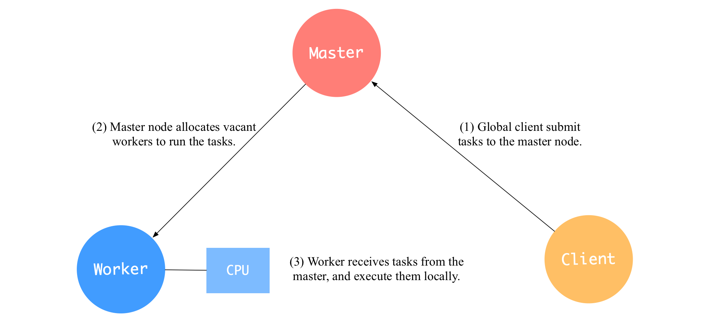
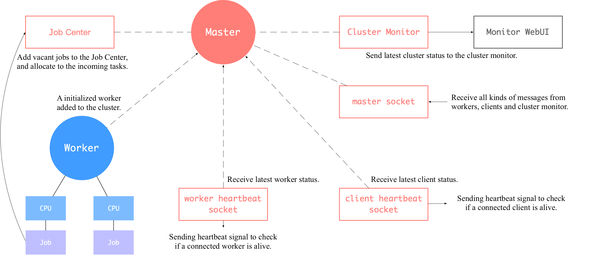
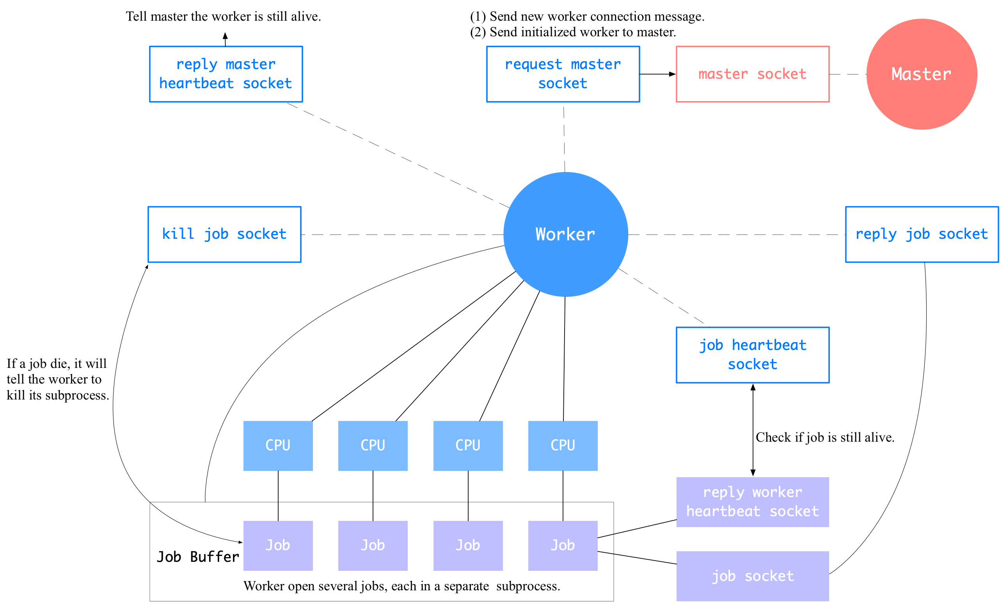
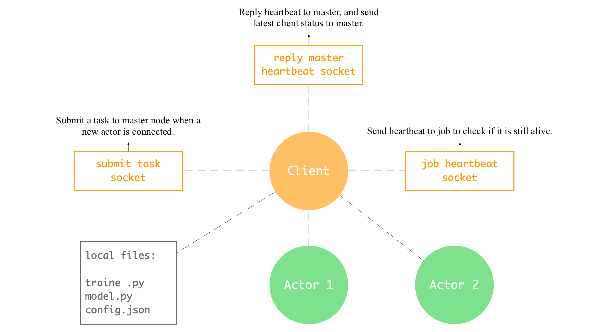

Parl Cluster
============

Get Started
###########

Cluster Structure Overview
--------------------------

| There are three core concepts in a Parl cluster: master, worker and client.

- **Master:** The master node is the control center of a parl cluster, which
  provides connections to workers and clients. It receives tasks from clients
  and allocate vacant workers to run the tasks.

- **Worker:** A worker provides the cpu computation resources for the cluster.
  It will initiate separate job subprocesses waiting for tasks from the master.

- **Client:** For each training program, there is a unique global client which
  submits tasks to the master node.

Master
------
| There is only one master node in each parl cluster, we can start a master by
  calling ``xparl start --port 1234`` with a assigned port number. This command
  will also simultaneously start a local worker which connects to the new
  master.

| **master socket** will receive all kinds of message from workers, clients or
  cluster monitor, such as:

- A new worker connects the cluster. The master will start a heartbeat to check
  worker's status, and worker's jobs will be added to master's job center.
- A new client connects the cluster: The master will start a heartbeat to check
  client's status, and wait for client to submit a task.
- A worker updates its job buffer: The master will replace the new jobs for the
  killed old jobs in the job center.
- Cluster monitor query cluster status: The master will return the detailed
  status of the cluster (i.e. total cpu number, used cpu number, load average
  ...) to the monitor.

Worker
------

| We can add more computation resources to a existed cluster by calling
  ``xparl --connect master_address`` command. This command will create a local
  **Worker** object and then connect to the cluster.

| When we start a new worker, it will first initiate separate job subprocesses
  in a job buffer. And then send the initialized worker to the master node.

| The worker will send a heartbeat signal to each job to check if it's still
  alive. When the worker find a job subprocess is dead, it will drop the dead
  job from the job buffer, start a new job and update worker information to
  the master node.

Client
------

| We have a global client for each training program, it submits training tasks
  to the master node. User do not need to interact with client object directly.
  We can create a new global client or get an existed global client by calling
  ``parl.connect(master_address)``.

| The global client will read local python scripts and configuration files,
  which will later be sent to remote jobs.

Actor
-----

| **Actor** is an object defined by users which aims to solve a specific task.
  We use ``@parl.remote_class`` decorator to convert an actor to a
  remote class object, and each actor is connected to the global client.  

.. code-block:: python

  # connect global client to the master node
  parl.connect(master_address)

  @parl.remote_class
  class Actor(object)
    def __init__(self):
     ...

| When a decorated actor class object is instantiated, the global client will
  submit a task to the master node. Then the master node will pick a vacant job
  from the job center and send the job back to the client. The actor will make
  a connection with the job and send local files, class definition and
  initialization arguments to the job. Then the job will instantiate a local
  actor in the job process.

| When the actor call a function, the real computation will be executed in the
  job process by job's local actor.

.. image:: ./actor.png
  :width: 600px
  :align: center
