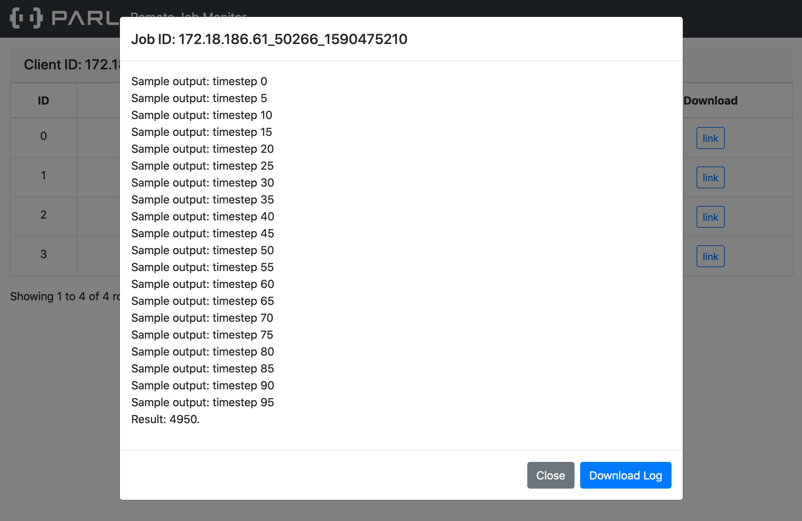

How to Debug
==================

The class modified by the parallel decorator does not run locally, but runs on the cluster. Accordingly, we cannot see the printed log on the local machine, such as the previous code.

.. code-block:: python

    import parl

    @parl.remote_class
    class Actor(object):
      def hello_world(self):
          print("Hello world.")

      def add(self, a, b):
          return a + b

    # connect to master node in cluster
    parl.connect("localhost:6006")

    actor = Actor()
    actor.hello_world()# because we are running on the cluster so this line will print nothing

In this scenario, how can we debug and locate the problems? We recommend two solutions here:

* **Comment out the parallel decorator**, first run the code locally, debug according to the log, then deploy your script on cluster by uncomment the parallel decorator. However, this method may cause the problem of repeated definition of static graphs in the static graph neural network framework, so this method is not recommended when using static version of paddle or tensorflow.
* **Check according to xparl's log service**. After the local script is connected to the xparl cluster, xparl will output the address of the logserver in the program. You can view the corresponding output of each parallel task in real time by visiting this website through a browser.

