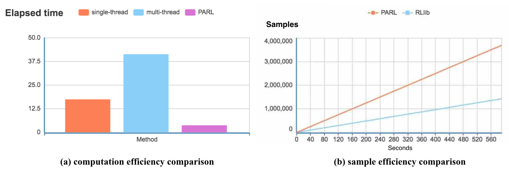

Features
========

Highlights
##########

Simple usage
^^^^^^^^^^^^
| With a single `@parl.remote_class` decorator, we can access cluster's remote
 computation resources to run our jobs easily. We can add any machine at
 anytime to the cluster, and PARL will take care of the network communication
 or resources allocation for us.

High performance
^^^^^^^^^^^^^^^^
| `@parl.remote_class` enable us to achieve real multi-thread computation
 efficiency without modifying our codes. As shown in figure (a), python's
 original multi-thread computation performs poorly due to the limitation
 of the GIL, while PARL empowers us to realize real parallel computation
 efficiency.

Convenient visualization
^^^^^^^^^^^^^^^^^^^^^^^^
| PARL also provides a web monitor to watch the cluster status. We can use
 `xparl status` command to visualize the details of our cluster status,
 including cpu usage, memory usage, average cpu loads and file executable
 paths. When any error happens, user can soon locate the bugs.

Board compatibility
^^^^^^^^^^^^^^^^^^^
| PARL is compatible with any other frameworks, like tensorflow, pytorch or
 mxnet. By adding `@parl.remote_class` decorator to their code, users can
 easily convert their code to distributed computation.

Advantages
##########

High throughput
^^^^^^^^^^^^^^^
| PARL uses a point-to-point connection for network communication in the
 cluster. Unlike other framework like RLlib which replies on redis for
 communication, PARL is able to achieve much higher throughput. The results
 can be found in figure (b).

Automatic deployment
^^^^^^^^^^^^^^^^^^^^
| Unlike other parallel framework like Ray, which fails to import modules from
 external files. PARL will automatically package all related files and send
 them to remote machines.

