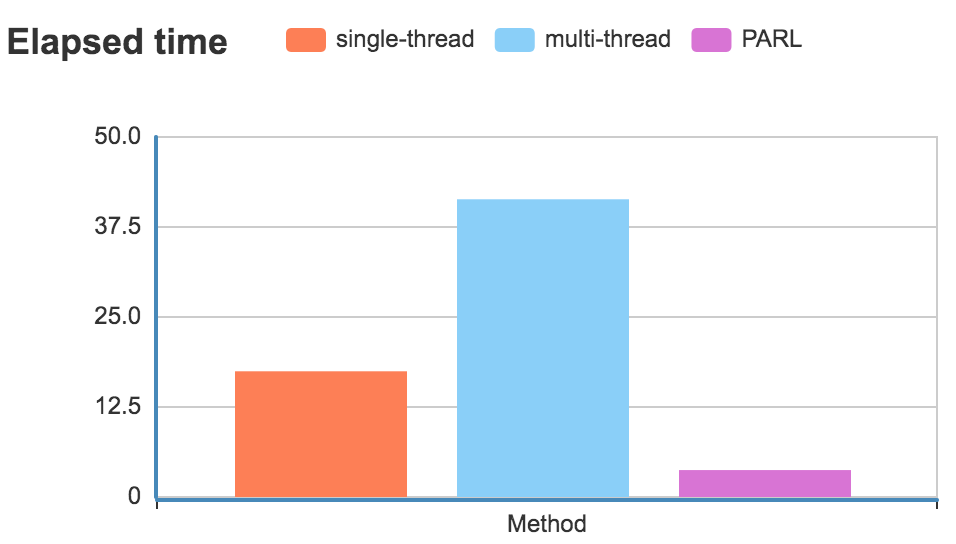

Recommended Practice
---------------------

| This tutorial shows how to use ``@parl.remote_class`` to implement parallel computation with **multi-threads**.

| Python has poor performance in multi-threading because of the `GIL <https://realpython.com/python-gil/>`_ , and we always find that multi-thread programming in Python cannot bring any benefits of the running speed, unlike other program languages such as ``C++`` and ``JAVA``. 

Here we reveal the performance of Python threads. At first, let's run the following code:

.. code-block:: python

    class A(object):
        def run(self):
            ans = 0
            for i in range(100000000):
                ans += i
    a = A()
    for _ in range(5):
        a.run() 

| This code takes **17.46** seconds to finish counting from 1 to 1e8 for five times. 
| Now let's implement a thread-based code using the Python library, ``threading``, as shown below.

.. code-block:: python

    import threading

    class A(object):
        def run(self):
            ans = 0
            for i in range(100000000):
                ans += i
    threads = []
    for _ in range(5):
        a = A()
        th = threading.Thread(target=a.run)
        th.start()
        threads.append(th)
    for th in threads:
        th.join()

| It takes **41.35** seconds, much slower than previous code that finish counting serially. As the performance is limited by the GIL, there is only a single CPU running the task, and the CPU has to spend additional time on switching tasks between different threads.

| Finally, let's try to use PARL:

.. code-block:: python
    :emphasize-lines: 4,11

    import threading
    import parl

    @parl.remote_class
    class A(object):
        def run(self):
            ans = 0
            for i in range(100000000):
                ans += i
    threads = []
    parl.connect("localhost:6006")
    for _ in range(5):
        a = A()
        th = threading.Thread(target=a.run)
        th.start()
        threads.append(th)
    for th in threads:
        th.join()

| Only **3.74** seconds are needed !!! As you can see from the code above, it is the ``@parl.remote_class`` that makes the change happen. By simply adding this decorator, we achieved real multi-thread computation.
