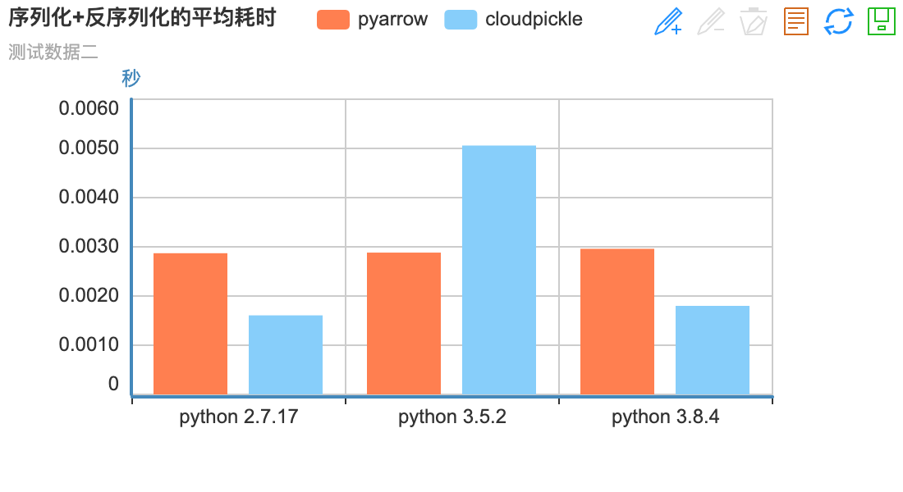
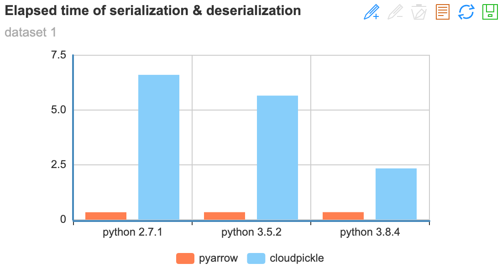

Serialization Acceleration (Not Necessary)
=============================================

PARL uses the ``cloudpickle`` library by default for data serialization and deserialization [In xparl, data is transmitted in the form of a serialized byte stream]; If the ``pyarrow`` library is in the Python environment, the ``pyarrow`` library will be used for serialization and deserialization (due to ``pyarrow``'s compatibility, PARL will not download the library by default).

Under different scenarios, ``pyarrow`` and ``cloudpickle`` have their advantages and disadvantages, users can choose among these libraries base on the need. In general, the serialization protocol that comes with ``python3.8+`` can meet the needs of most scenarios.

Performance Comparison
#######################

As reference, here is the average time taken for serialization and deserialization using ``pyarrow`` and ``cloudpickle`` on different testing data.

* testing data 1: ``data = [np.random.RandomState(0).randn(50, 50)] * 10``
* testing data 2: ``data = [np.random.RandomState(0).randn(500, 500)] * 10``
* testing data 3: ``data = [np.random.RandomState(0).randn(5000, 5000)] * 10``
* testing data 4: ``data = np.random.RandomState(0).randn(5000, 50000)``

> pyarrow version: python2: pyarrow==0.16.0，python3: pyarrow==2.0.0

Conclusions
#######################

* When serializing/deserializing large ``Numpy`` matrix, ``pyarrow`` perform better than ``cloudpickle``
* Using ``python>=3.8`` can improve the serializing/deserializing performance. (Mainly because pickle is updated in ``python>=3.8``, it now supports ``protocol=5``)

