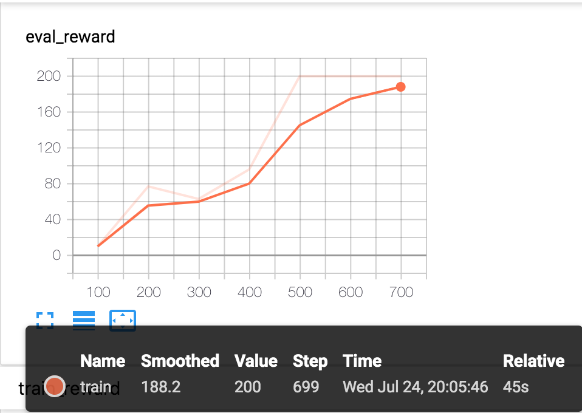

Getting Started
======================

**Goal of this tutorial**:

  - Understand PARL's abstraction at a high level
  - Be familiar with the modules that need to be used in the process of constructing the agent

This tutorial will use the code from `example <https://github.com/PaddlePaddle/PARL/tree/develop/examples/QuickStart>`_ to explain any solution to the classic Cartpole problem by constructing an agent through PARL.

Introduction to CartPole Problem
-----------------------------------

CartPole is also called an inverted pendulum. A pole is placed on a car, and the pole will fall due to gravity. In order to prevent the pole from falling down, we have to move the car to keep it upright. As shown below. At each time step, the input of the model is a 4-dimensional vector that represents the current state of the car and the rod, and the signal output by the model is used to control the car to move to the left or right.
When the pole is not down, the environment will give 1 reward point for each time step; when the pole is down, the environment will not give any reward point, and the game is over.

.. image:: ../../examples/QuickStart/performance.gif
  :width: 300px
  :align: center

Model
-----
``Model`` defines Forward Network, it is usually a Policy Network or a Value Function Network. The current environment status (State) is the input to the Network.

First, let's build a ``Model`` that is a Forward Neural Network with two fully connected layers.

.. code-block:: python

    import paddle
    import paddle.nn as nn
    import paddle.nn.functional as F
    import parl

    class CartpoleModel(parl.Model):
        def __init__(self, obs_dim, act_dim):
            super(CartpoleModel, self).__init__()
            hid1_size = act_dim * 10
            self.fc1 = nn.Linear(obs_dim, hid1_size)
            self.fc2 = nn.Linear(hid1_size, act_dim)

        def forward(self, x):
            out = paddle.tanh(self.fc1(x))
            prob = F.softmax(self.fc2(out), axis=-1)
            return prob

There are three major steps defining a Forward Network:

* Inherit ``parl.Model`` class
* Initialize layers in ``__init__`` function
* Build the Neural Network in ``forward`` function

In the above example code, we first initialize two ``nn.Linear`` layers and activation layers in ``__init__`` function, then we define the computation in ``forward`` function: for an input observation, it first goes through a fully connected
layer followed by a tanh activation function, then the output of previous computation goes through another full connected layer followed by a softmax activation function. Finally we get the probability for each action.

Algorithm
----------
``Algorithm`` will update the parameters of the ``Model`` passed to it. In general, we define the loss function in ``Algorithm``.
In this tutorial, we solve the benchmark `Cartpole` using the `Policy Graident` algorithm, which has been implemented in our repository.
Thus, we can simply use this algorithm by importing it from ``parl.algorithms``.

.. code-block:: python

  model = CartpoleModel(act_dim=2)
  algorithm = parl.algorithms.PolicyGradient(model, lr=1e-3)

After initialize the ``Model``, we pass the instance to the ``Algorithm``.

Agent
----------

``Agent`` is used to interact with the environment to generate training data. The training data is then passed to ``Algorithm`` to update the parameters of ``Model``.

We need to inherit ``parl.Agent`` class to define our customized ``Agent``. We first demonstrate the code, then walk through step by step.

.. code-block:: python

    class CartpoleAgent(parl.Agent):

        def __init__(self, algorithm):

            super(CartpoleAgent, self).__init__(algorithm)

        def sample(self, obs):

            obs = paddle.to_tensor(obs, dtype='float32')
            prob = self.alg.predict(obs)
            prob = prob.numpy()
            act = np.random.choice(len(prob), 1, p=prob)[0]

            return act

        def predict(self, obs):

            obs = paddle.to_tensor(obs, dtype='float32')
            prob = self.alg.predict(obs)
            act = prob.argmax().numpy()[0]

            return act

        def learn(self, obs, act, reward):

            act = np.expand_dims(act, axis=-1)
            reward = np.expand_dims(reward, axis=-1)
            obs = paddle.to_tensor(obs, dtype='float32')
            act = paddle.to_tensor(act, dtype='int32')
            reward = paddle.to_tensor(reward, dtype='float32')

            loss = self.alg.learn(obs, act, reward)

            return loss.numpy()[0]

In general, users have to implement the following functions:

* ``__init__`` function: the input is previously defined ``Algorithm``. Note that we need to call ``super(CartpoleAgent, self).__init__(algorithm)``.
* ``predict`` function: return a predicted action based on current observation, this function is often used for evaluation and deployment of the ``Agent``.
* ``sample`` function: return a sampled action based on current observation, this function is often used in training to help the ``Agent`` explore the observation space.

Start Training
----------------------

First, let's build a Cartpole ``Agent``. As the code shown below, we first initialize the ``Model``, then the ``Algorithm``, finally the ``Agent``.

.. code-block:: python

    model = CartpoleModel(obs_dim=obs_dim, act_dim=act_dim)
    alg = parl.algorithms.PolicyGradient(model, lr=LEARNING_RATE)
    agent = CartpoleAgent(alg)

Then we use this agent to interact with the environment, and run around 1000 episodes for training, after which this agent can solve the problem.

.. code-block:: python

    def run_train_episode(agent, env):

        obs_list, action_list, reward_list = [], [], []
        obs = env.reset()

        while True:
            obs_list.append(obs)
            action = agent.sample(obs)
            action_list.append(action)

            obs, reward, done, info = env.step(action)
            reward_list.append(reward)

            if done:
                break

        return obs_list, action_list, reward_list

    env = gym.make("CartPole-v0")

    for i in range(1000):
          obs_list, action_list, reward_list = run_episode(env, agent)

          if i % 10 == 0:
              logger.info("Episode {}, Reward Sum {}.".format(i, sum(reward_list)))

          batch_obs = np.array(obs_list)
          batch_action = np.array(action_list)
          batch_reward = calc_reward_to_go(reward_list)

          agent.learn(batch_obs, batch_action, batch_reward)

          if (i + 1) % 100 == 0:
              _, _, reward_list = run_episode(env, agent, train_or_test='test')
              total_reward = np.sum(reward_list)

              logger.info('Test reward: {}'.format(total_reward))

Summary
-----------

.. image:: ../../examples/QuickStart/performance.gif
  :width: 300px

In this tutorial, we have shown how to build an ``Agent`` step-by-step to solve the `Cartpole` problem.

The whole training code could be found `here <https://github.com/PaddlePaddle/PARL/tree/develop/examples/QuickStart>`_. Have a try quickly by running several commands:

.. code-block:: shell

	# Install dependencies
	pip install paddlepaddle  
	
	pip install gym
	git clone https://github.com/PaddlePaddle/PARL.git
	cd PARL
	pip install .
	
	# Train model
	cd examples/QuickStart/
	python train.py  
	
