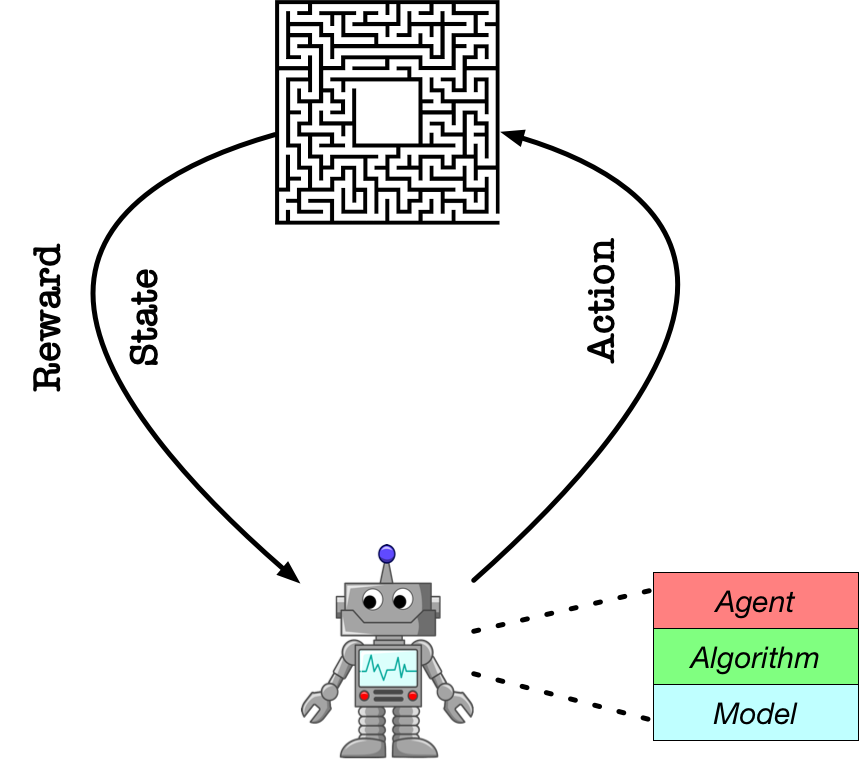

# **教程：子模块说明**
<p align="center">

</p>
在上一个教程中，我们快速地展示了如果通过PARL的三个基础模块：Model Algorithm, Agent 来搭建智能体和环境进行交互的。在这个教程中，我们将详细介绍每个模块的具体定位，以及使用规范。


## Model
- 定义：`Model` 用来定义前向(Forward)网络，这通常是一个策略网络(Policy Network)或者一个值函数网络(Value Function)，输入是当前环境状态(State)。
- **⚠️注意事项**：用户得要继承`parl.Model`这个类来构建自己的Model。
- 需要实现的函数：
    - forward: 根据在初始化函数中声明的计算层来搭建前向网络。
- 备注：在PARL中，实现强化学习常用的target network很方便的，直接调用**deepcopy**即可。
- 示例：
```python
import paddle
import paddle.nn as nn
import paddle.nn.functional as F
import parl

class CartpoleModel(parl.Model):
    def __init__(self, obs_dim, act_dim):
        super(CartpoleModel, self).__init__()
        hid1_size = act_dim * 10
        self.fc1 = nn.Linear(obs_dim, hid1_size)
        self.fc2 = nn.Linear(hid1_size, act_dim)

    def forward(self, x):
        out = paddle.tanh(self.fc1(x))
        prob = F.softmax(self.fc2(out), axis=-1)
        return prob

if __name__ == '__main__:
    model = CartpoleModel()
    target_model = deepcopy.copy(model)
```


## Algorithm
- 定义：`Algorithm` 定义了具体的算法来更新前向网络(Model)，也就是通过定义损失函数来更新Model。一个Algorithm包含至少一个Model。
- **⚠️注意事项**：一般不自己开发，推荐直接import 仓库中已经实现好的算法。
- 需要实现的函数（`开发新算法才需要`）：
    - learn: 根据训练数据（观测量和输入的reward），定义损失函数，用于更新Model中的参数。
    - predict: 根据当前的观测量，给出动作概率分布或者Q函数的预估值。
- 示例：
```python
model = CartpoleModel()
alg = parl.algorithms.PolicyGradient(model, lr=1e-3)
```


## Agent
- 定义：`Agent` 负责算法与环境的交互，在交互过程中把生成的数据提供给Algorithm来更新模型(Model)，数据的预处理流程也一般定义在这里。
- **⚠️注意事项**：需要继承`parl.Agent`来使用，要在构造函数中调用父类的构造函数。
- 需要实现的函数：
    - learn： 输入训练数据，更新模型参数。
    - predict： 根据环境状态返回预测动作（action），一般用于评估和部署agent。
    - sample:：根据环境状态返回动作（action），一般用于训练时候采样action进行探索。
- 示例：
```python
class CartpoleAgent(parl.Agent):
    def __init__(self, algorithm):
        super(CartpoleAgent, self).__init__(algorithm)

    def learn(self, obs, act, reward):
        # 在这里对数据进行预处理，同时准备好数据feed给上面定义的program
        act = np.expand_dims(act, axis=-1)
        feed = {
            'obs': obs.astype('float32'),
            'act': act.astype('int64'),
            'reward': reward.astype('float32')
        }
        cost = self.fluid_executor.run(
            self.train_program, feed=feed, fetch_list=[self.cost])[0]
        return cost
        
    def learn(self, obs, act, reward):
        #在这里对数据进行预处理，同时准备好数据用于训练
        act = np.expand_dims(act, axis=-1)
        reward = np.expand_dims(reward, axis=-1)

        obs = paddle.to_tensor(obs, dtype='float32')
        act = paddle.to_tensor(act, dtype='int32')
        reward = paddle.to_tensor(reward, dtype='float32')

        loss = self.alg.learn(obs, act, reward)
        return loss.numpy()[0]

    def predict(self, obs):
        #输入观测量，返回用于评估的action
        obs = paddle.to_tensor(obs, dtype='float32')
        prob = self.alg.predict(obs)
        act = prob.argmax().numpy()[0]
        return act

    def sample(self, obs):
        # 输入观测量，返回用于探索的action
        obs = paddle.to_tensor(obs, dtype='float32')
        prob = self.alg.predict(obs)
        prob = prob.numpy()
        act = np.random.choice(len(prob), 1, p=prob)[0]
        return act

if __name__ == '__main__':
    model = CartpoleModel()
    alg = parl.algorithms.PolicyGradient(model, lr=1e-3)
    agent = CartpoleAgent(alg, obs_dim=4, act_dim=2)
```
