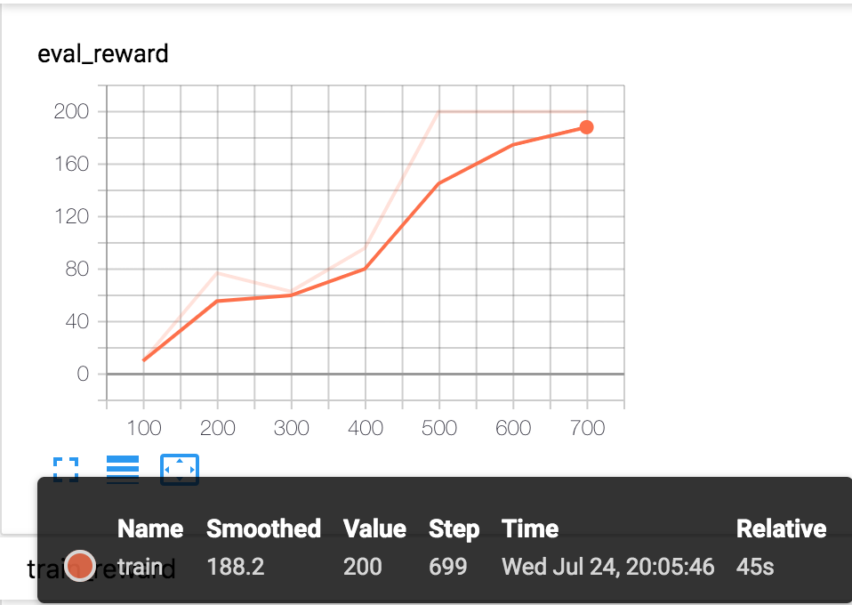

# **教程：使用PARL解决Cartpole问题**

本教程会使用 [示例](https://github.com/PaddlePaddle/PARL/tree/develop/examples/QuickStart)中的代码来解释任何通过PARL构建智能体解决经典的Cartpole问题。

本教程的目标：
- 熟悉PARL构建智能体过程中需要用到的子模块。

## CartPole 介绍

CartPole又叫倒立摆。小车上放了一根杆，杆会因重力而倒下。为了不让杆倒下，我们要通过移动小车，来保持其是直立的。如下图所示。 在每一个时间步，模型的输入是一个4维的向量,表示当前小车和杆的状态，模型输出的信号用于控制小车往左或者右移动。当杆没有倒下的时候，每个时间步，环境会给1分的奖励；当杆倒下后，环境不会给任何的奖励，游戏结束。

<p align="center">

</p>

## Model

**Model** 主要定义前向网络，这通常是一个策略网络(Policy Network)或者一个值函数网络(Value Function)，输入是当前环境状态(State)。

首先，我们构建一个包含2个全连接层的前向网络。

```python
import parl
from parl import layers

class CartpoleModel(parl.Model):
    def __init__(self, act_dim):
        act_dim = act_dim
        hid1_size = act_dim * 10

        self.fc1 = layers.fc(size=hid1_size, act='tanh')
        self.fc2 = layers.fc(size=act_dim, act='softmax')

    def forward(self, obs):
        out = self.fc1(obs)
        out = self.fc2(out)
        return out
```
定义前向网络的主要三个步骤：
- 继承`parl.Model`类
- 构造函数`__init__`中声明要用到的中间层
- 在`forward`函数中搭建网络

以上，我们现在构造函数中声明了两个全连接层以及其激活函数，然后在`forward`函数中定义了网络的前向计算方式：输入一个状态，然后经过两层FC，最后得到的是每个action的概率预测。

## Algorithm

**Algorithm** 定义了具体的算法来更新前向网络(Model)，也就是通过定义损失函数来更新Model。一个Algorithm包含至少一个Model。在这个教程中，我们将使用经典的PolicyGradient算法来解决问题。由于PARL仓库已经实现了这个算法，我们只需要直接import来使用即可。

```python
model = CartpoleModel(act_dim=2)
algorithm = parl.algorithms.PolicyGradient(model, lr=1e-3)
```
在实例化了Model之后，我们把它传给algorithm。

## Agent
**Agent** 负责算法与环境的交互，在交互过程中把生成的数据提供给Algorithm来更新模型(Model)，数据的预处理流程也一般定义在这里。

我们得要继承`parl.Agent`这个类来实现自己的Agent，下面先把Agent的代码抛出来，再按照函数解释：
```python
class CartpoleAgent(parl.Agent):
    def __init__(self, algorithm, obs_dim, act_dim):
        self.obs_dim = obs_dim
        self.act_dim = act_dim
        super(CartpoleAgent, self).__init__(algorithm)

    def build_program(self):
        self.pred_program = fluid.Program()
        self.train_program = fluid.Program()

        with fluid.program_guard(self.pred_program):
            obs = layers.data(
                name='obs', shape=[self.obs_dim], dtype='float32')
            self.act_prob = self.alg.predict(obs)

        with fluid.program_guard(self.train_program):
            obs = layers.data(
                name='obs', shape=[self.obs_dim], dtype='float32')
            act = layers.data(name='act', shape=[1], dtype='int64')
            reward = layers.data(name='reward', shape=[], dtype='float32')
            self.cost = self.alg.learn(obs, act, reward)

    def sample(self, obs):
        obs = np.expand_dims(obs, axis=0)
        act_prob = self.fluid_executor.run(
            self.pred_program,
            feed={'obs': obs.astype('float32')},
            fetch_list=[self.act_prob])[0]
        act_prob = np.squeeze(act_prob, axis=0)
        act = np.random.choice(range(self.act_dim), p=act_prob)
        return act

    def predict(self, obs):
        obs = np.expand_dims(obs, axis=0)
        act_prob = self.fluid_executor.run(
            self.pred_program,
            feed={'obs': obs.astype('float32')},
            fetch_list=[self.act_prob])[0]
        act_prob = np.squeeze(act_prob, axis=0)
        act = np.argmax(act_prob)
        return act

    def learn(self, obs, act, reward):
        act = np.expand_dims(act, axis=-1)
        feed = {
            'obs': obs.astype('float32'),
            'act': act.astype('int64'),
            'reward': reward.astype('float32')
        }
        cost = self.fluid_executor.run(
            self.train_program, feed=feed, fetch_list=[self.cost])[0]
        return cost
```
一般情况下，用户必须实现以下几个函数：
- 构造函数：
把algorithm传进来，以及相关的环境参数（用户自定义的）。需要注意的是，这里必须得要初始化父类：super(CartpoleAgent, self).\_\_init\_\_(algorithm)。
- build_program: 定义paddle里面的program。通常需要定义两个program：一个用于训练，一个用于预测。
- predict: 根据输入返回预测动作（action）。
- sample：根据输入返回动作（action），带探索的动作。
- learn: 输入训练数据，更新算法。

## 开始训练
首先，我们来定一个智能体。逐步定义model|algorithm|agent，然后得到一个可以和环境进行交互的智能体。
```python
model = CartpoleModel(act_dim=2)
alg = parl.algorithms.PolicyGradient(model, lr=1e-3)
agent = CartpoleAgent(alg, obs_dim=OBS_DIM, act_dim=2)
```
然后我们用这个agent和环境进行交互，训练模型，1000个episode之后，agent就可以很好地解决Cartpole问题，拿到满分（200）。
```python
def run_episode(env, agent, train_or_test='train'):
    obs_list, action_list, reward_list = [], [], []
    obs = env.reset()
    while True:
        obs_list.append(obs)
        if train_or_test == 'train':
            action = agent.sample(obs)
        else:
            action = agent.predict(obs)
        action_list.append(action)

        obs, reward, done, info = env.step(action)
        reward_list.append(reward)

        if done:
            break
    return obs_list, action_list, reward_list

env = gym.make("CartPole-v0")
for i in range(1000):
      obs_list, action_list, reward_list = run_episode(env, agent)
      if i % 10 == 0:
          logger.info("Episode {}, Reward Sum {}.".format(i, sum(reward_list)))

      batch_obs = np.array(obs_list)
      batch_action = np.array(action_list)
      batch_reward = calc_discount_norm_reward(reward_list, GAMMA)

      agent.learn(batch_obs, batch_action, batch_reward)
      if (i + 1) % 100 == 0:
          _, _, reward_list = run_episode(env, agent, train_or_test='test')
          total_reward = np.sum(reward_list)
          logger.info('Test reward: {}'.format(total_reward))
```

## 总结




在这个教程，我们展示了如何一步步地构建强化学习智能体，用于解决经典的Cartpole问题。完整的训练代码可以在这个[文件夹](https://github.com/PaddlePaddle/PARL/tree/develop/examples/QuickStart)中找到。赶紧执行下面的代码运行尝试下吧：）

```shell
# Install dependencies
pip install paddlepaddle

pip install gym
git clone https://github.com/PaddlePaddle/PARL.git
cd PARL
pip install .

# Train model
cd examples/QuickStart/
python train.py
```
