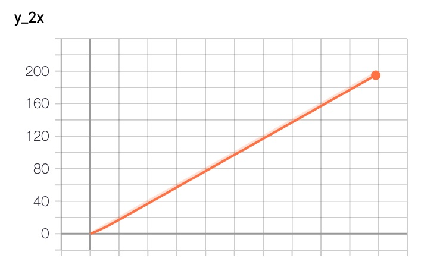
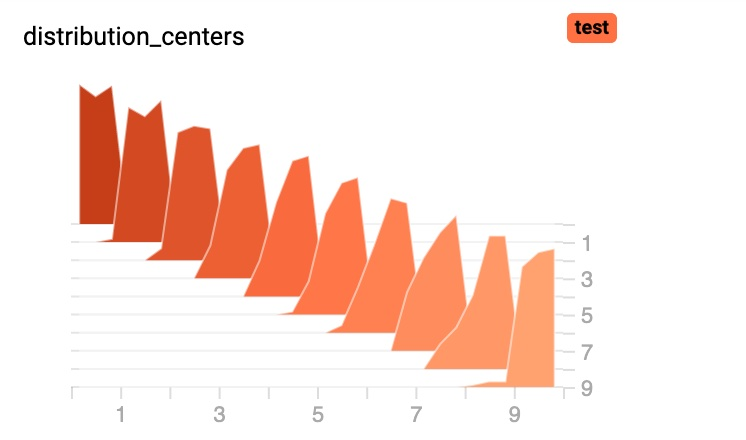

# **教程：绘制训练曲线**
PARL集成了tensorboardX作为可视化的工具。工具导入方法：

`from parl.utils import summary`。


### 折线图接口：add_scalar
summary.add_scalar(tag, scalar_value, global_step=None)

常用的参数
- tag (string) – Data identifier
- scalar_value (float or string/blobname) – Value to save
- global_step (int) – Global step value to record

例子：
```python
from parl.utils import summary

x = range(100)
for i in x:
    summary.add_scalar('y=2x', i * 2, i)
```
预期结果：



### 柱形接口：add_histogram

summary.add_histogram(tag, values, global_step=None)

常用的参数
- tag (string) – Data identifier
- values (np.ndarray) – histogram of which to be saved
- global_step (int) – Global step value to record

例子：
```python
from parl.utils import summary
import numpy as np

for i in range(10):
    x = np.random.random(1000)
    summary.add_histogram('distribution centers', x + i, i)
```

预期结果：



### 修改数据保存路径接口
默认的数据保存路径是:`./train_log`, summary的数据路径和logger绑定到一起的，所以直接修改logger的保存路径即可：
```python
from parl.utils import logger
logger.set_dir('./train_log/exp1')
```
