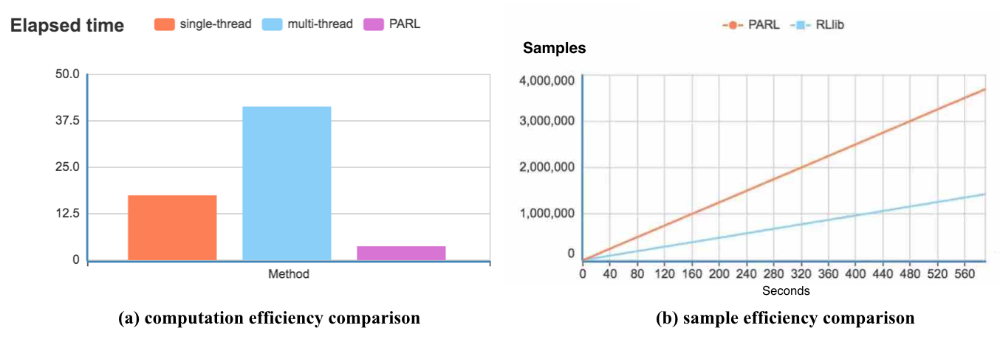

# **PARL并行核心介绍： XPARL**

随着强化学习能够解决的问题变得复杂，算法对于训练数据的需求也变得更大，为了提升算法的训练速度，PARL借鉴了[Pyro4](https://github.com/irmen/Pyro4)的设计理念，提出了更为高效实用的并行接口。

### 简单易用
通过一个简单的修饰符`@parl.remote_class`，用户就可以很简单地实现并行计算，无需关注繁琐的多进程通讯以及网络通讯，也不受Python多线程GIL锁的限制。

### 高性能
`@parl.remote_class` 可以让我们实现真正意义上的多线程并发计算（堪比C++的多线程）。正如下图a所示，python原生的多线程加速表现很糟糕（由于全局锁GIL的存在），但是我们可以看到，PARL的并行可以线性地减少运行时间，从而提升并发效率。

### Web 页面监控集群信息
在多机并行计算的时候，PARL在启动集群的时候提供了web服务，用户可以通过这个页面查看每台机器上的内存、CPU使用率等，同时也可以查看每个任务占用了多少集群资源。

### 全框架兼容
PARL的并行可以兼容目前市场上的任何深度学习框架，比如tensorflow、pytorch、mxnet等。通过增加并行修饰符`@parl.remote_class`，用户就可以把他们之前的代码转换成并行代码。

# 为什么用PARL

## 高吞吐量、高并发
PARL在实现底层的并行计算时，是通过端到端的这种网络传输，也就是在进行并发任务时，没有额外的网络损耗。这种并行设计，相比于RLlib需要通过Redis进行数据中转，PARL在同样的时间内，有更高的数据吞吐量。根据我们之前做的实验对比，运行同样的IMPALA算法，在同样的机器上，PARL的并行性能是更优秀的。

## 自动分发本地文件
市面上的并行框架大部分得要用户手动同步文件才可以跑起并行代码，比如配置文件得要手动或者通过命令分发到不同机器，parl可以自动分发当前目录下的代码文件，实现无缝的多机并行。

