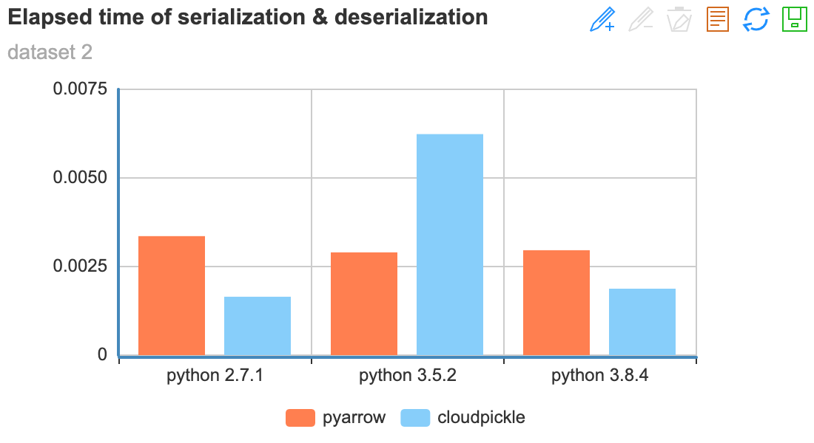
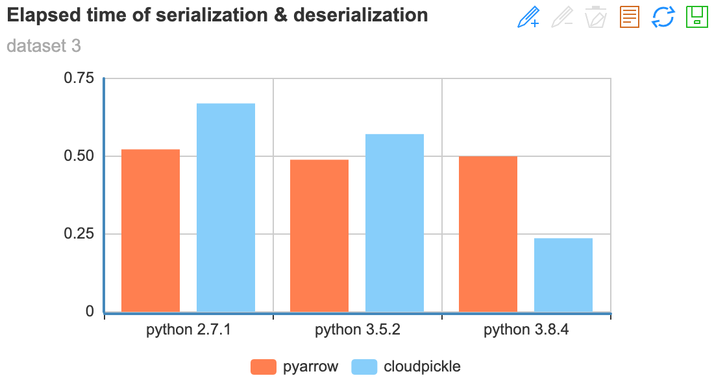

# **序列化/反序列化加速（非必须）**

PARL默认使用cloudpickle库进行数据的序列化和反序列化【数据是以序列化后的字节流形式在xparl中进行传输】；如果Python环境有下载pyarrow库的话，则会使用pyarrow库进行序列化和反序列化（由于pyarrow兼容性不够好，PARL不会默认下载该库）。

不同数据场景下，pyarrow和cloudpickle的表现优劣不同，用户可以基于自己的使用场景选择是否要下载pyarrow库，一般而言，使用python3.8+自带的序列化协议已经可以满足大部分场景的需求。

### 性能对比
这里提供了pyarrow和cloudpickle在不同数据下的序列化和反序列化的平均耗时作为参考：

- 测试数据一：`data = [np.random.RandomState(0).randn(50, 50)] * 10`
- 测试数据二：`data = [np.random.RandomState(0).randn(500, 500)] * 10`
- 测试数据三：`data = [np.random.RandomState(0).randn(5000, 5000)] * 10`
- 测试数据四：`data = np.random.RandomState(0).randn(5000, 50000)`

> pyarrow版本：python2使用pyarrow==0.16.0，python3中使用pyarrow==2.0.0

 
 

### 对比结论
- 在序列化/反序列化**超大Numpy矩阵**时，pyarrow表现明显比cloudpickle好
- 使用3.8+版本的Python也能提升序列化性能。（主要是python3.8+版本对pickle进行了升级，支持protocol=5）
