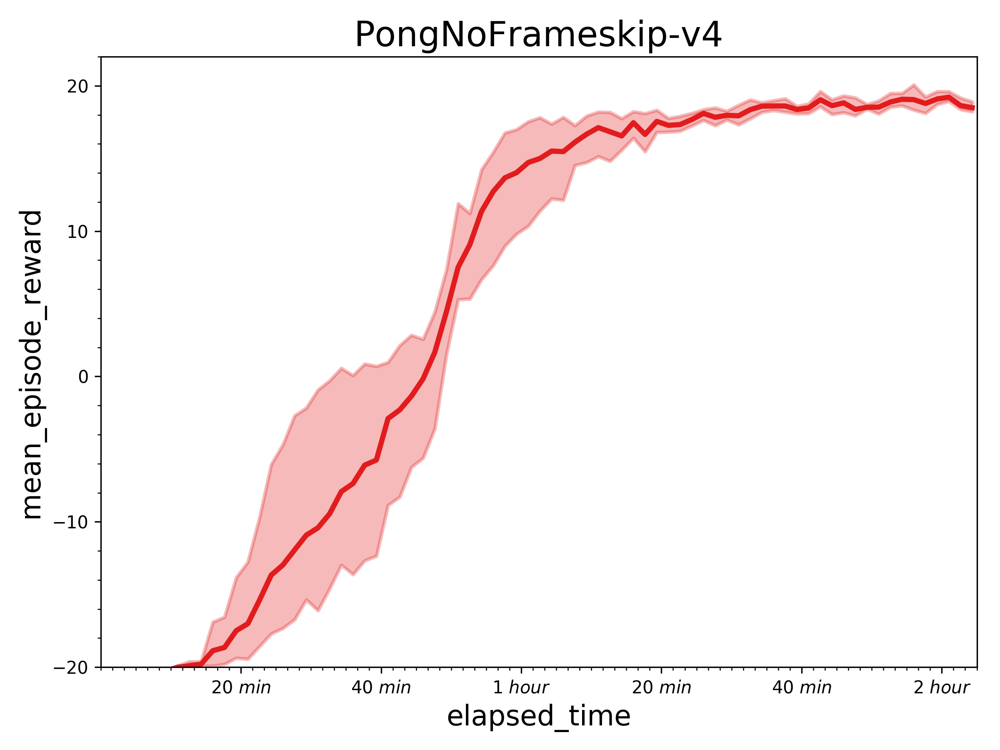
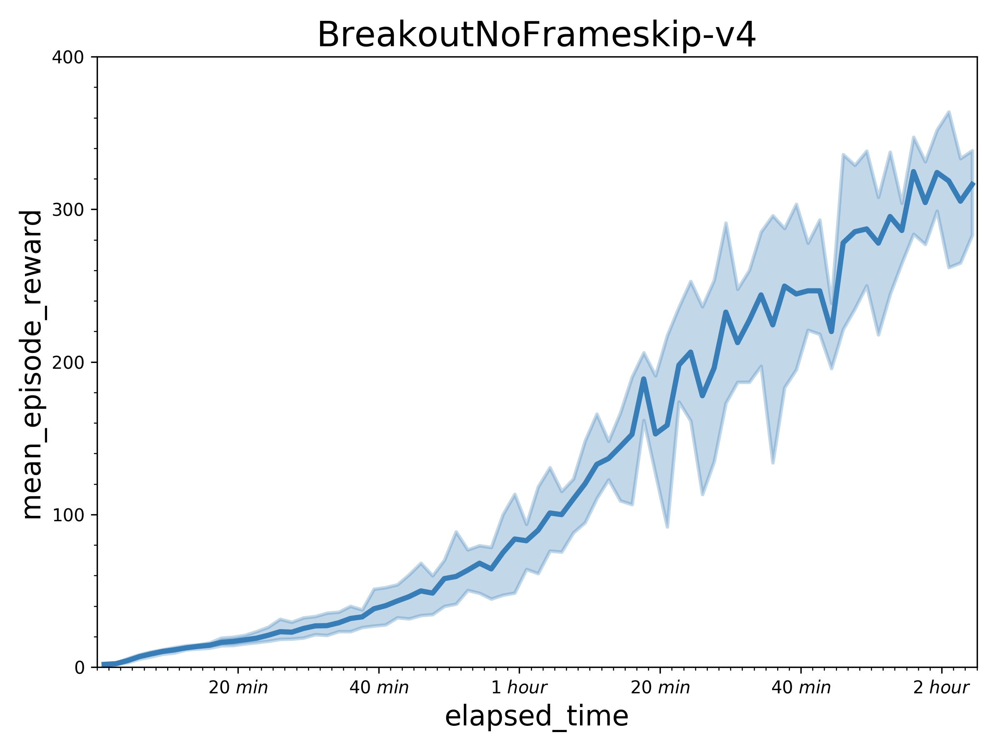

## Reproduce A2C with PARL
Based on PARL, the A2C algorithm of deep reinforcement learning has been reproduced, reaching the same level of indicators as the paper in Atari benchmarks.

A2C is a synchronous, deterministic variant of [Asynchronous Advantage Actor Critic (A3C)](https://arxiv.org/abs/1602.01783). Instead of updateing asynchronously in A3C or GA3C, A2C uses a synchronous approach that waits for each actor to finish its sampling before performing an update. Since loss definition of these A3C variants are identical, we use a common a3c algotrithm `parl.algorithms.A3C` for A2C and GA3C examples.

### Atari games introduction
Please see [here](https://gym.openai.com/envs/#atari) to know more about Atari game.

### Benchmark result
Results with one learner (in a P40 GPU) and 5 actors in 10 million sample steps.
 

## How to use
### Dependencies
+ python2.7 or python3.5+
+ [paddlepaddle>=1.3.0](https://github.com/PaddlePaddle/Paddle)
+ [parl](https://github.com/PaddlePaddle/PARL)
+ gym
+ opencv-python
+ atari_py


### Distributed Training

#### Learner
```sh
python train.py 
```

#### Actors (Suggest: 5 actors in 5 CPUs)
```sh
for i in $(seq 1 5); do
    python actor.py &
done;
wait
```

You can change training settings (e.g. `env_name`, `server_ip`) in `a2c_config.py`.
Training result will be saved in `log_dir/train/result.csv`.

### Reference
+ [Ray](https://github.com/ray-project/ray)
+ [OpenAI Baselines: ACKTR & A2C](https://openai.com/blog/baselines-acktr-a2c/)
