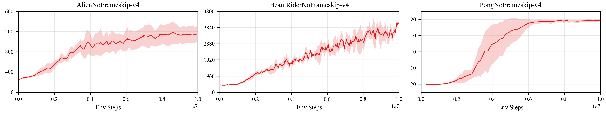
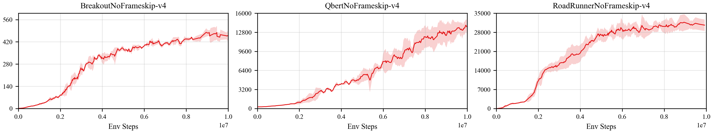

## Reproduce A2C with PARL
Based on PARL, the A2C algorithm of deep reinforcement learning has been reproduced, reaching the same level of indicators as the paper in Atari benchmarks.

### Atari game introduction
Please see [here](https://gym.openai.com/envs/#atari) to know more about Atari games.

### Benchmark result
Performance of A2C on some envrionments in training process after 10 million sample steps.

<p align="center">

</p>
<p align="center">

</p>


## How to use
### Dependencies
+ [paddlepaddle>=2.0.0](https://github.com/PaddlePaddle/Paddle)
+ [parl>=1.4.3](https://github.com/PaddlePaddle/PARL)
+ gym==0.12.1
+ atari-py==0.1.7


### Distributed Training

At first, we can start a local cluster with 5 CPUs:

```bash
xparl start --port 8010 --cpu_num 5
```

Note that if you have started a master before, you don't have to run the above
command. For more information about the cluster, please refer to our
[documentation](https://parl.readthedocs.io/en/latest/parallel_training/setup.html)

Then we can start the distributed training by running:

```bash
python train.py
```

### Reference
+ [Parl](https://parl.readthedocs.io/en/latest/parallel_training/setup.html)
+ [Ray](https://github.com/ray-project/ray)
+ [OpenAI Baselines: ACKTR & A2C](https://openai.com/blog/baselines-acktr-a2c/)
