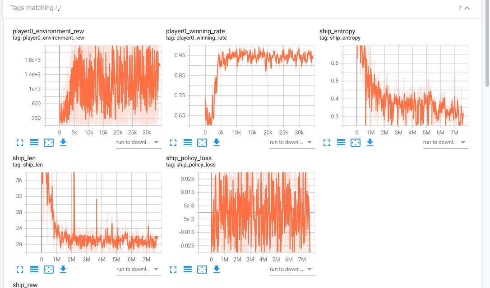

# RL Baseline for Halite Game
Based on PARL, we use the PPO algorithm to design a baseline for the halite game

## Contents

The following files are inclueded in the rl_trainer folder to implement the ppo algorithm

* model
  * model.py : Define the structure of actor and critic network
* agent
  * agent.py : The agent inheriting the PARL agent class, which will be used to train the ppo algorithm
* algorithm
  * algorithm.py : The implementation of the PPO algorithm
* controller
  * controller.py : Define the class and method to give action for each ship and shipyard
* rule policy
  * policy.py : Define some rule based policy like 'return to the base'
* observation
  * obs_parser.py : Design the observation of a single ship


# How to use
## Installation
Create a virtual environment and activate it
```shell
conda create -n halite python==3.6

source activate halite
```

Install the dependencies
```shell
pip install -r requirements.txt
```

## Designing
In this repository, we control the ships by the ppo algorithm and the shipyard by rule based policy. The objective of ships is to obtain K units of haltie in less steps and the shipyard needs to spawn ships until the number of ships reaches a defined threshold. 

## Training
Use default parameters setting or change them in config.py and start training by runing the following command
```shell
python train.py
```

## Testing
It's easy to test your model by running the script 'test.py'. Before that, you need to load your trained model in the script or change the opponent to be a trained agent if you like.
```shell
python test.py
```

## Results
The following figure illurastrates the learning performance. Right now, we only train the algorithm with a specific seed and the opponent is set to be random agent. To obtain a good ranking in the competition, it's of great need to train a robust model, whcih can adapt to environments with different seeds or configurations (1vs1, 1vs3). We release the trained model in the folder '/model' and you can load this trained model and fine tune it in other environments.



## Visualizing
The original environments provides a way to visualize the results. If you want to see the animation, you can activate the jupyter notebook environment and  open the test.ipynb notebook to see how to visualize the results.

## Submitting

Only one file can be uploaded to the competition platform. Please pack all functions you need in a single file. To load a trained model, you need to encode the model into bytes and put it in the file. After that, you can decode and load the model. We provide a sample(e.g. **submission.py**) to show you how to do this. Besides, you can check encode_model.py to see how to encode the trained model.

Another thing you need to pay attention to is that the scoring system will only use the function at the end of the uploaded file. That‘s to say you need to design a function which takes observation and configuration as input and return the action, and put it at the end of the file. Please check **submission.py** to see how to do this.、
