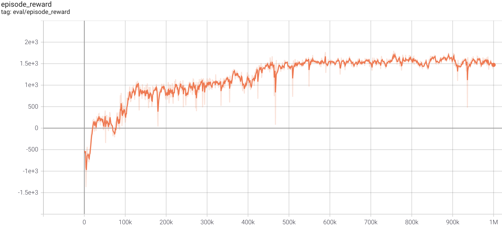
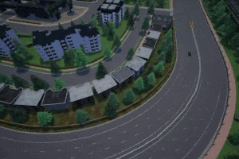

## SAC in Carla simulator
Based on [PARL](https://github.com/PaddlePaddle/PARL) and [PaddlePaddle](https://github.com/PaddlePaddle/Paddle), 
a parallel version of SAC was implemented and achieved high performance in the CARLA environment.
> Paper: SAC in [Soft Actor-Critic: Off-Policy Maximum Entropy Deep Reinforcement Learning with a Stochastic Actor](https://arxiv.org/abs/1801.01290)

### Carla simulator introduction
Please view [Carla simulator](https://github.com/carla-simulator/carla/releases/tag/0.9.6) to know more about Carla simulator.

### Benchmark result


+ Result was evaluated with mode `Lane`

## How to use
+ System: Ubuntu 16.04
### Dependencies:
+ [parl>=2.0.0](https://github.com/PaddlePaddle/PARL)
+ [paddlepaddle>=2.0.0](https://github.com/PaddlePaddle/Paddle)
+ [CARLA_0.9.6](https://github.com/carla-simulator/carla/releases/tag/0.9.6)
  ```CARLA
  # Download CARLA_0.9.6, extract it to a folder, 
  cd ${YOUR_FLODER}
  wget http://carla-assets-internal.s3.amazonaws.com/Releases/Linux/CARLA_0.9.6.tar.gz
  mkdir CARLA_0.9.6
  tar -zxf CARLA_0.9.6.tar.gz -C CARLA_0.9.6
  
  # and add the folder path to `PYTHONPATH` environment variable
  $ export PYTHONPATH="${YOUR_FLODER}/CARLA_0.9.6/PythonAPI/carla/dist/carla-0.9.6-py3.5-linux-x86_64.egg:$PYTHONPATH"
  ```
+ [gym_carla](https://github.com/ShuaibinLi/gym_carla.git)
  ```gym_carla
  $ git clone https://github.com/ShuaibinLi/gym_carla.git
  $ cd gym_carla
  $ pip install -r requirements.txt
  $ pip install -e .
  ```

### Start Training
1. Open another(new) terminal, enter the CARLA root folder and launch CARLA service. 
   There are two modes to start CARLA service: <br>
   (1) non-display mode
    ```start env
    $ DISPLAY= ./CarlaUE4.sh -opengl -carla-port=2021
    ```
   (2) display mode
   ```start_env
   $ ./CarlaUE4.sh -windowed -carla-port=2021
   ```
   + Start three CARLA services (ports: 2021,2023,2025) for data collecting and training, 
     one service (port: 2027) for evaluating.
   
2. For parallel training, we can execute the following [xparl](https://parl.readthedocs.io/en/stable/parallel_training/setup.html) command to start a PARL cluster：
   ```Parallelization
   $ xparl start --port 8080
   ```
   check xparl cluster status by `xparl status`

3. Start training
   ```train
   # Make sure 'localhost:8080' in train.py is the same as xparl address
   $ python train.py
   ```
#### Evaluate trained agent
Open another(new) terminal, enter the CARLA root folder and launch CARLA service with display mode. 
```start_test
$ ./CarlaUE4.sh -windowed -carla-port=2029
```
Visualize the evaluation with the trained model.
```
$ python evaluate.py --restore_model model.ckpt
