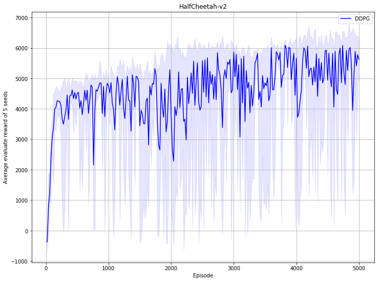

## Reproduce DDPG with PARL
Based on PARL, the DDPG model of deep reinforcement learning is reproduced, and the same level of indicators of the paper is reproduced in the classic Mujoco game.

+ DDPG in
[Continuous control with deep reinforcement learning](https://arxiv.org/abs/1509.02971)

### Mujoco games introduction
Please see [here](https://github.com/openai/mujoco-py) to know more about Mujoco game.

### Benchmark result
- HalfCheetah-v2
  

## How to use
### Dependencies:
+ python2.7 or python3.5+
+ [paddlepaddle>=1.0.0](https://github.com/PaddlePaddle/Paddle)
+ [parl](https://github.com/PaddlePaddle/PARL)
+ gym
+ tqdm
+ mujoco-py>=1.50.1.0

### Start Training:
```
# To train an agent for HalfCheetah-v2 game
python train.py

# To train for other game
# python train.py --env [ENV_NAME]
