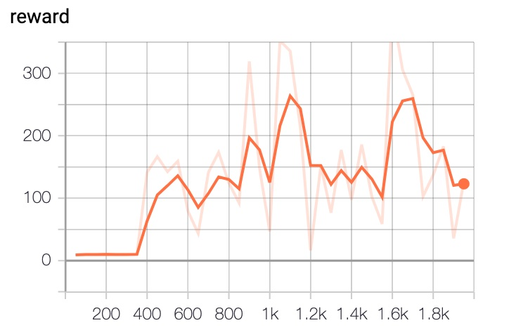

## Reproduce DQN with PARL
Based on PARL, we provide a simple demonstration of DQN.

+ DQN in
[Human-level Control Through Deep Reinforcement Learning](http://www.nature.com/nature/journal/v518/n7540/full/nature14236.html)

### Result

Performance of DQN playing CartPole-v1

<p align="left">

</p>

## How to use
### Dependencies:
+ [paddlepaddle>=1.6.1](https://github.com/PaddlePaddle/Paddle)
+ [parl](https://github.com/PaddlePaddle/PARL)
+ gym
+ tqdm


### Start Training:
```
# To train a model for CartPole-v1 game
python train.py
```

## DQN-Variants

For complete implementation of DQN, please check [DQN_varient](https://github.com/PaddlePaddle/PARL/tree/develop/examples/DQN_variant)
