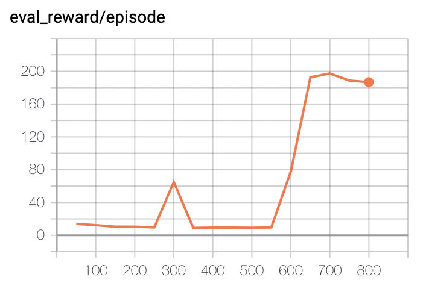

## Running DQN on XPU
We provide a simple demonstration of running DQN on XPU.

+ Paper: DQN in [Human-level Control Through Deep Reinforcement Learning](http://www.nature.com/nature/journal/v518/n7540/full/nature14236.html)

### Result

Performance of DQN playing CartPole-v0

<p align="left">


</p>

## How to use
### Dependencies:
+ [paddlepaddle>=2.0](https://github.com/PaddlePaddle/Paddle)
+ [parl](https://github.com/PaddlePaddle/PARL)
+ gym
+ tqdm


### Using XPU
To use xpu, you should set environment variable FLAGS_selected_xpus == {your xpu card index}.
```
export FLAGS_selected_xpus=0
```

### Start Training:
```
# To train a model for CartPole-v0 game
python train_with_xpu.py
```
