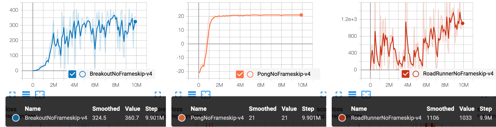
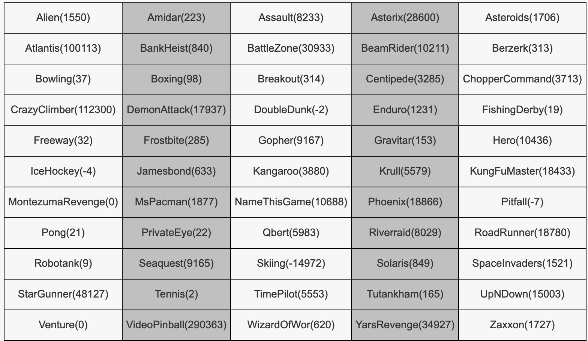

## Reproduce DQN with PARL
Based on PARL, the DQN algorithm of deep reinforcement learning has been reproduced, reaching the same level of indicators as the paper in Atari benchmarks.

+ DQN in
[Human-level Control Through Deep Reinforcement Learning](http://www.nature.com/nature/journal/v518/n7540/full/nature14236.html)

### Atari games introduction
Please see [here](https://gym.openai.com/envs/#atari) to know more about Atari games.

### Benchmark result

Mean episode rewards for 10 million training steps.

 

Performance of DQN on various environments

<p align="center">

</p>

## How to use
### Dependencies:
+ [paddlepaddle>=1.6.1](https://github.com/PaddlePaddle/Paddle)
+ [parl](https://github.com/PaddlePaddle/PARL)
+ gym
+ tqdm
+ atari-py
+ [ale_python_interface](https://github.com/mgbellemare/Arcade-Learning-Environment)


### Start Training:
```
# To train a model for Pong game
python train.py --rom ./rom_files/pong.bin
```
> To train more games, you can install more rom files from [here](https://github.com/openai/atari-py/tree/master/atari_py/atari_roms).
