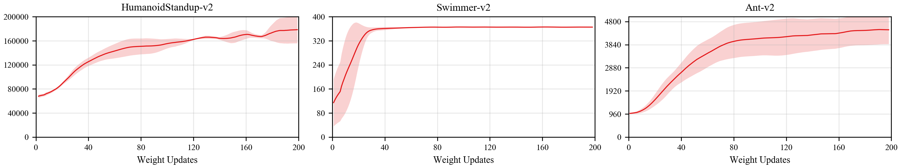
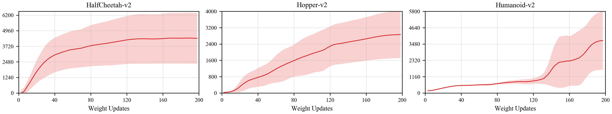

## Reproduce ES with PARL
Based on PARL, we have implemented the Evolution Strategies (ES) algorithm and evaluate it in Mujoco environments. Its performance reaches the same level of indicators as the paper.

+ ES in
[Evolution Strategies as a Scalable Alternative to Reinforcement Learning](https://arxiv.org/abs/1703.03864)

### Mujoco games introduction
Please see [here](https://github.com/openai/mujoco-py) to know more about Mujoco games.

### Benchmark result




## How to use
### Dependencies
+ [paddlepaddle>=2.0.0](https://github.com/PaddlePaddle/Paddle)
+ [parl>=2.0.0](https://github.com/PaddlePaddle/PARL)
+ gym==0.18.0
+ mujoco-py==2.0.2.13


### Distributed training

To replicate the performance reported above, we encourage you to train with 24 or 48 CPUs.  
If you haven't created a cluster before, enter the following command to create a cluster. For more information about the cluster, please refer to our [documentation](https://parl.readthedocs.io/en/latest/parallel_training/setup.html).

```bash
xparl start --port 8037 --cpu_num 24
```

Then we can start the distributed training by running:


```bash
python train.py
```

Training result will be saved in `train_log` with the training curve.

### Reference
+ [Ray](https://github.com/ray-project/ray)
+ [evolution-strategies-starter](https://github.com/openai/evolution-strategies-starter)
