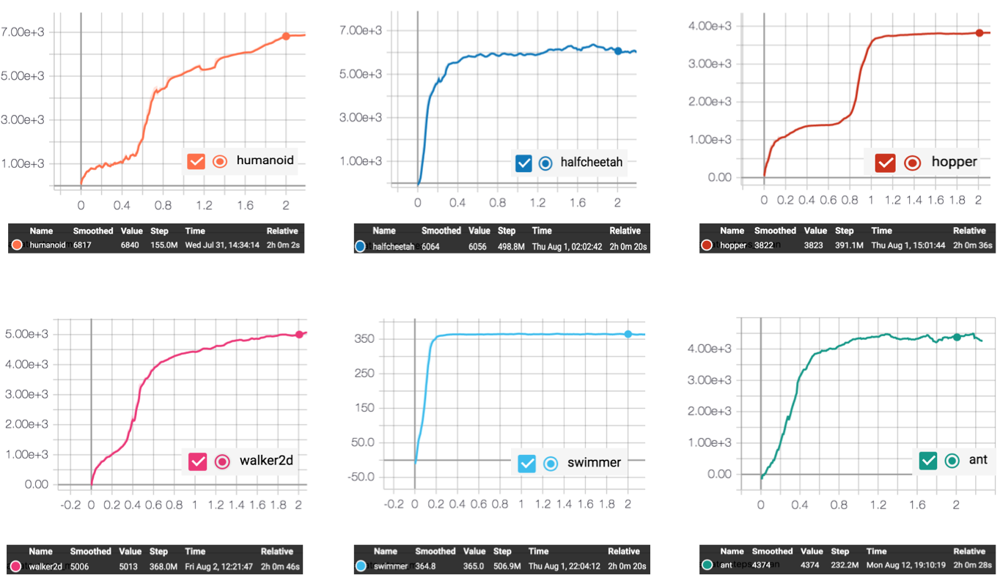

## Reproduce ES with PARL
Based on PARL, we have implemented the Evolution Strategies (ES) algorithm and evaluate it in Mujoco environments. Its performance reaches the same level of indicators as the paper.

+ ES in
[Evolution Strategies as a Scalable Alternative to Reinforcement Learning](https://arxiv.org/abs/1703.03864)

### Mujoco games introduction
Please see [here](https://github.com/openai/mujoco-py) to know more about Mujoco games.

### Benchmark result


## How to use
### Dependencies
+ [paddlepaddle>=1.5.1](https://github.com/PaddlePaddle/Paddle)
+ [parl](https://github.com/PaddlePaddle/PARL)
+ gym==0.9.4
+ mujoco-py==0.5.1


### Distributed Training

#### Learner
```sh
python learner.py 
```

#### Actors
```sh
sh run_actors.sh
```

You can change training settings (e.g. `env_name`, `server_ip`) in `es_config.py`. If you want to use different number of actors, please modify `actor_num` in both `es_config.py` and `run_actors.sh`.
Training result will be saved in `log_dir/train/result.csv`.

### Reference
+ [Ray](https://github.com/ray-project/ray)
+ [evolution-strategies-starter](https://github.com/openai/evolution-strategies-starter)
