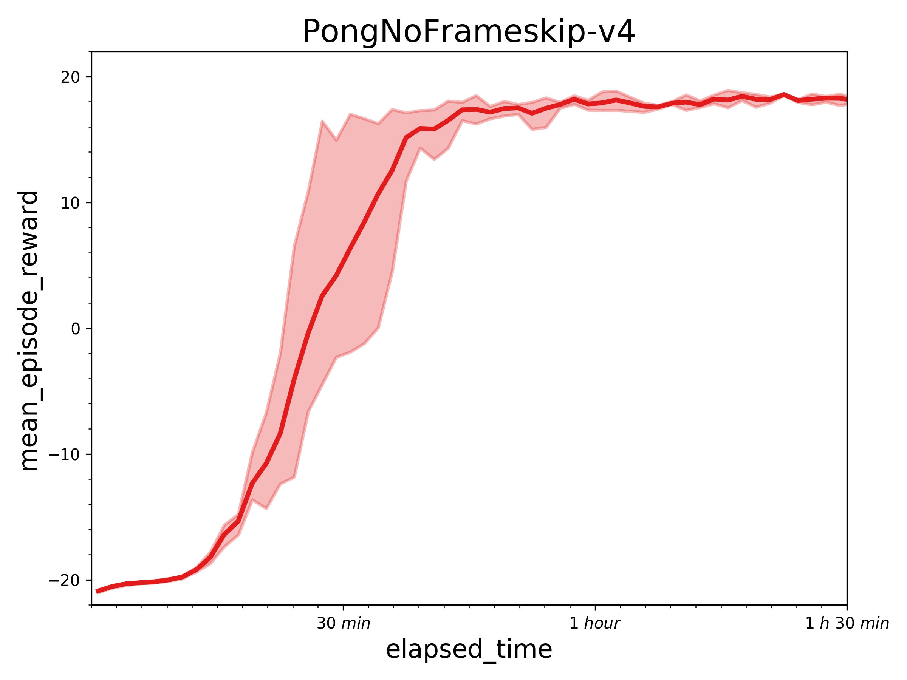
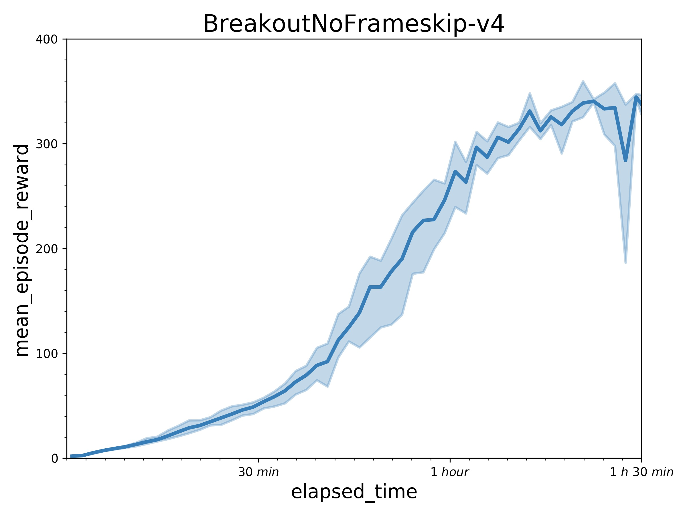

## Reproduce GA3C with PARL
Based on PARL, the GA3C algorithm of deep reinforcement learning has been reproduced, reaching the same level of indicators as the paper in Atari benchmarks.

Original paper: [GA3C: GPU-based A3C for Deep Reinforcement Learning](https://www.researchgate.net/profile/Iuri_Frosio2/publication/310610848_GA3C_GPU-based_A3C_for_Deep_Reinforcement_Learning/links/583c6c0b08ae502a85e3dbb9/GA3C-GPU-based-A3C-for-Deep-Reinforcement-Learning.pdf)

A hybrid CPU/GPU version of the [Asynchronous Advantage Actor-Critic (A3C)](https://arxiv.org/abs/1602.01783) algorithm.

### Atari games introduction
Please see [here](https://gym.openai.com/envs/#atari) to know more about Atari games.

### Benchmark result
Results with one learner (in a P40 GPU) and 24 simulators (in 12 CPU) in 10 million sample steps.
 

## How to use
### Dependencies
+ python2.7 or python3.5+
+ [paddlepaddle>=1.3.0](https://github.com/PaddlePaddle/Paddle)
+ [parl](https://github.com/PaddlePaddle/PARL)
+ gym
+ atari-py


### Distributed Training

#### Learner
```sh
python train.py 
```

#### Simulators (Suggest: 24 simulators in 12+ CPUs)
```sh
for i in $(seq 1 24); do
    python simulator.py &
done;
wait
```

You can change training settings (e.g. `env_name`, `server_ip`) in `ga3c_config.py`.
Training result will be saved in `log_dir/train/result.csv`.

[Tips] The performance can be influenced dramatically in a slower computational environment, especially when training with low-speed CPUs. It may be caused by the policy-lag problem.

### Reference
+ [tensorpack](https://github.com/tensorpack/tensorpack)
