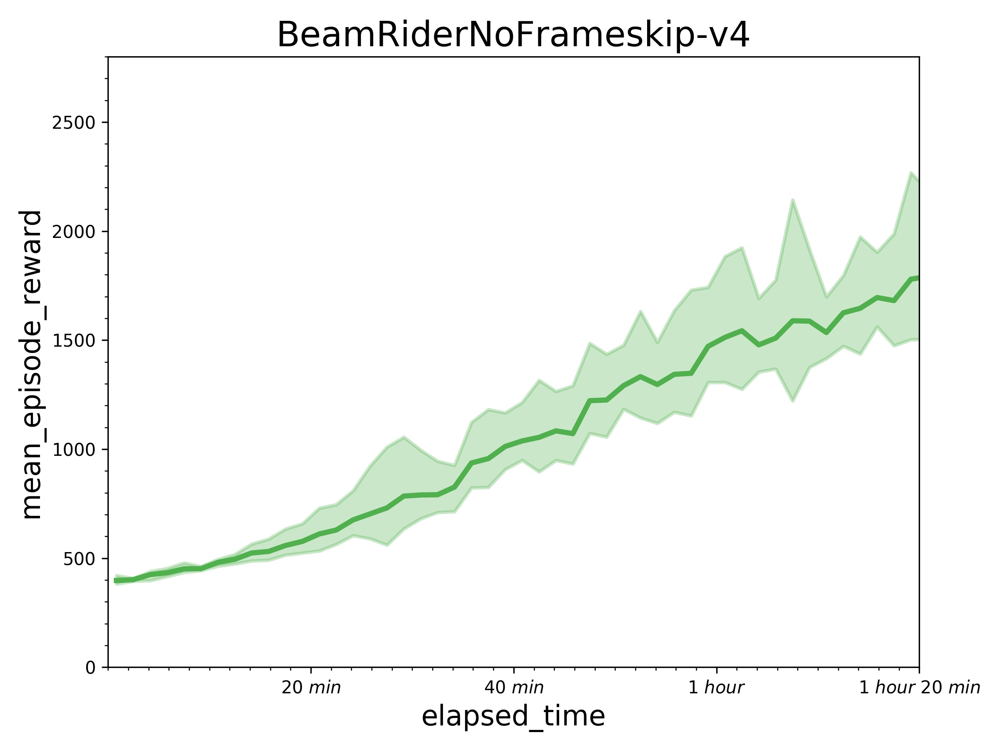
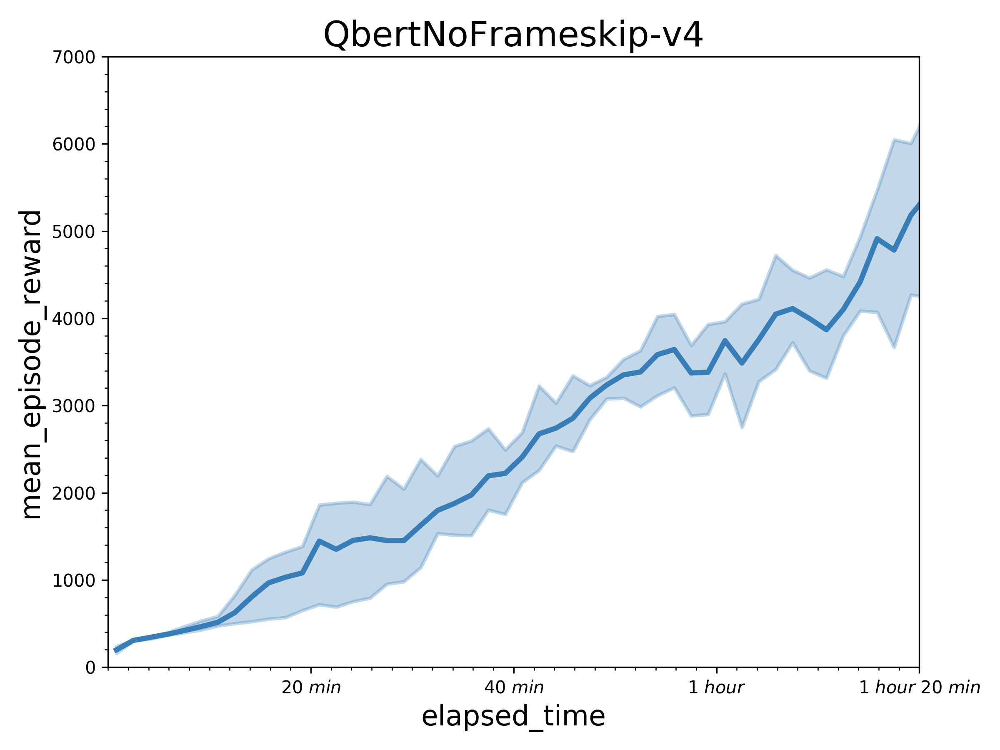
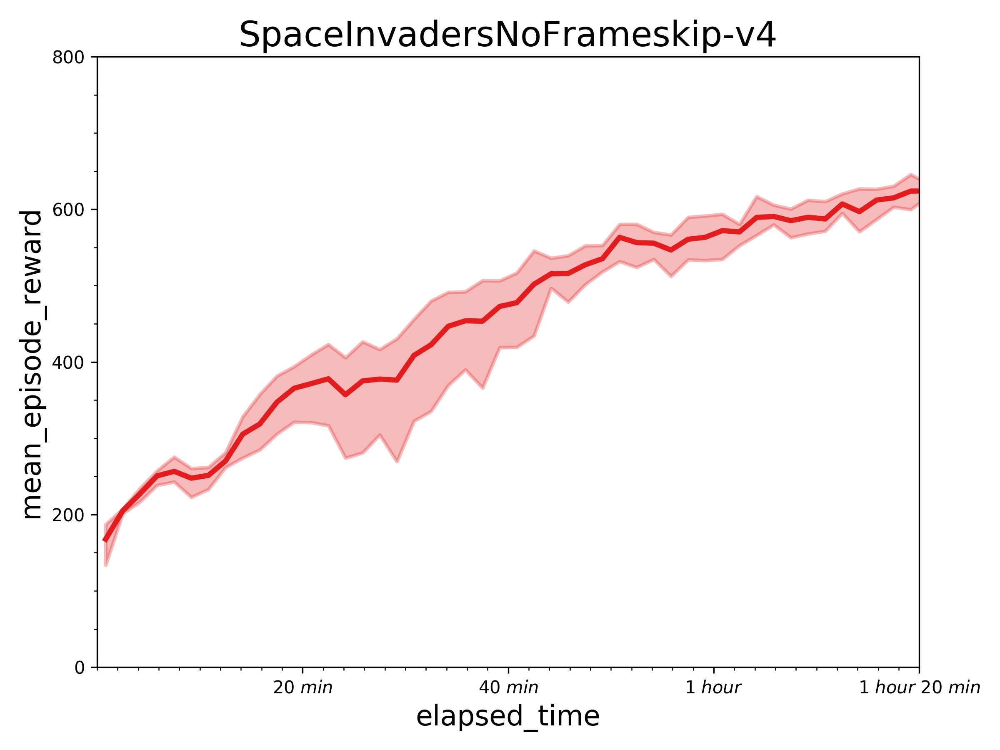

## Reproduce GA3C with PARL
Based on PARL, the GA3C algorithm of deep reinforcement learning has been reproduced, reaching the same level of indicators as the paper in Atari benchmarks.

Original paper: [GA3C: GPU-based A3C for Deep Reinforcement Learning](https://www.researchgate.net/profile/Iuri_Frosio2/publication/310610848_GA3C_GPU-based_A3C_for_Deep_Reinforcement_Learning/links/583c6c0b08ae502a85e3dbb9/GA3C-GPU-based-A3C-for-Deep-Reinforcement-Learning.pdf)

A hybrid CPU/GPU version of the [Asynchronous Advantage Actor-Critic (A3C)](https://arxiv.org/abs/1602.01783) algorithm.

### Atari games introduction
Please see [here](https://gym.openai.com/envs/#atari) to know more about Atari games.

### Benchmark result
Results with one learner (in a P40 GPU) and 24 simulators (in 12 CPU) in 10 million sample steps.
 
 


## How to use
### Dependencies
+ [paddlepaddle>=1.5.1](https://github.com/PaddlePaddle/Paddle)
+ [parl](https://github.com/PaddlePaddle/PARL)
+ gym
+ atari-py

### Distributed Training

We can start a local cluster with 8 CPUs by executing the `xparl start`
command:

```bash
xparl start --port 8010 --cpu_num 8
```

After the cluster is started, we can add more computation resources to our
cluster with the `xparl connect` command at any time and on any machine.

```bash
xparl connect --address master_address
```

Then we can start the distributed training by running `train.py`.

```bash
python train.py
```

If we have an existing cluster running at `cluster_address`, we can start a new
training task with this cluster by setting `'master_address' = cluster_address`
in the `ga3c_config.py`.

Training result will be saved in `log_dir/train/log.log` and the cluster logs
will be saved in `~/.parl_data/`. For more detailed information about the
usage of the parl cluster, please refer to our official document
[Parl Cluster Setup](https://parl.readthedocs.io/en/latest/parallel_training/setup.html).

[Tips] The performance can be influenced dramatically in a slower computational
environment, especially when training with low-speed CPUs. It may be caused by
the policy-lag problem.

### Reference
+ [Parl](https://parl.readthedocs.io/en/latest/parallel_training/setup.html)
+ [tensorpack](https://github.com/tensorpack/tensorpack)
