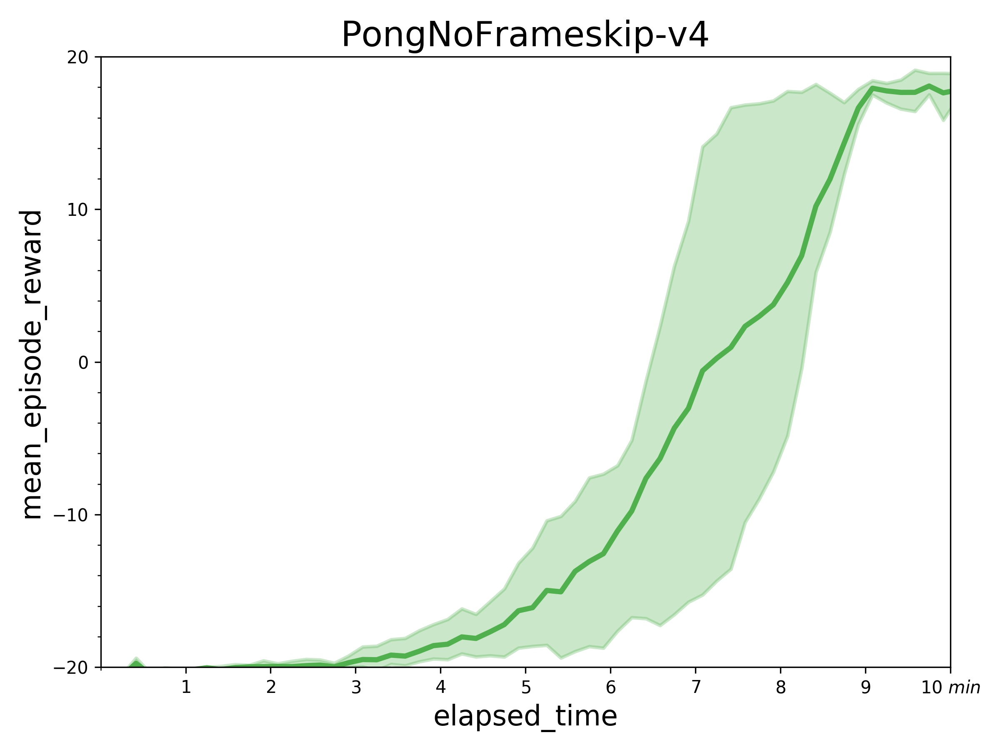
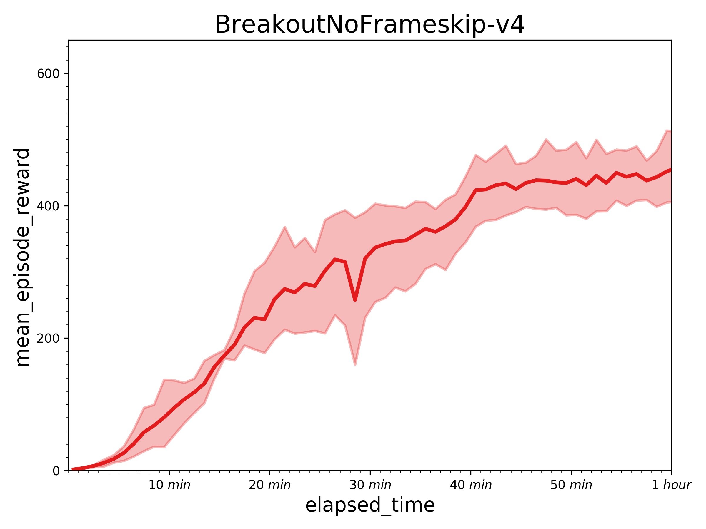
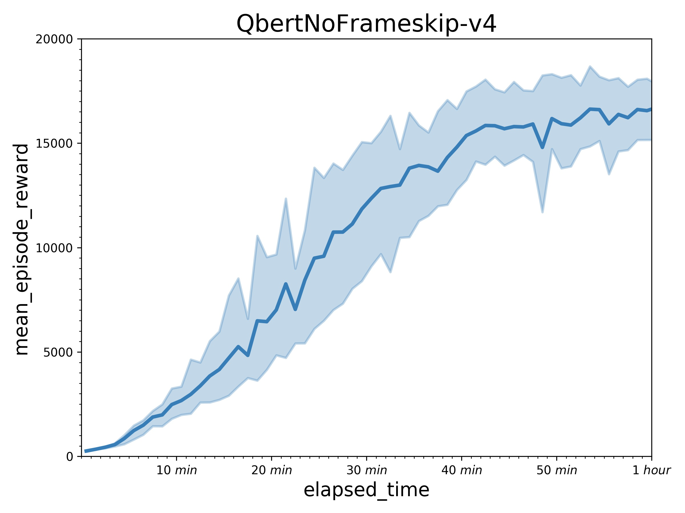

## Reproduce IMPALA with PARL
Based on PARL, the IMPALA algorithm of deep reinforcement learning is reproduced, and the same level of indicators of the paper is reproduced in the classic Atari game.

+ IMPALA in
[Impala: Scalable distributed deep-rl with importance weighted actor-learner architectures](https://arxiv.org/abs/1802.01561)

### Atari games introduction
Please see [here](https://gym.openai.com/envs/#atari) to know more about Atari games.

### Benchmark result
Result with one learner (in a P40 GPU) and 32 actors (in 32 CPUs).
+ PongNoFrameskip-v4: mean_episode_rewards can reach 18-19 score in about 7~10 minutes.


+ Results of other games in an hour.

 
<br>
 

## How to use
### Dependencies
+ python2.7 or python3.5+
+ [paddlepaddle>=1.3.0](https://github.com/PaddlePaddle/Paddle)
+ [parl](https://github.com/PaddlePaddle/PARL)
+ gym
+ atari_py


### Distributed Training:

#### Learner
```sh
python train.py 
```

#### Actors (Suggest: 32+ actors in 32+ CPUs)
```sh
for i in $(seq 1 32); do
    python actor.py &
done;
wait
```

You can change training settings (e.g. `env_name`, `server_ip`) in `impala_config.py`.
Training result will be saved in `log_dir/train/result.csv`.

### Reference
+ [deepmind/scalable_agent](https://github.com/deepmind/scalable_agent)
+ [Ray](https://github.com/ray-project/ray)
